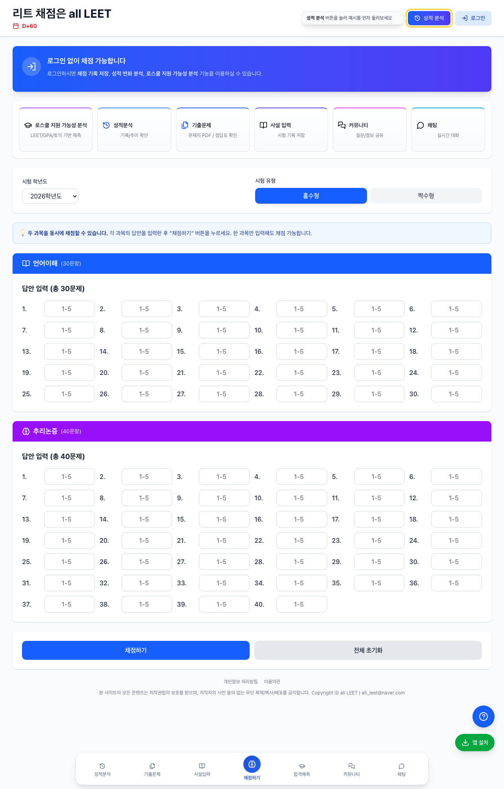
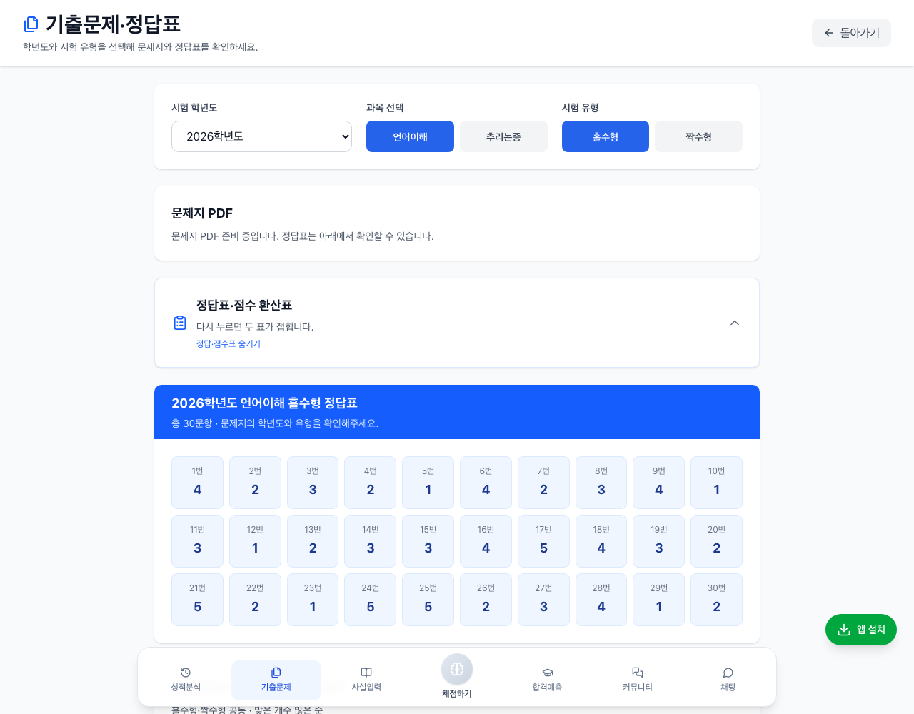
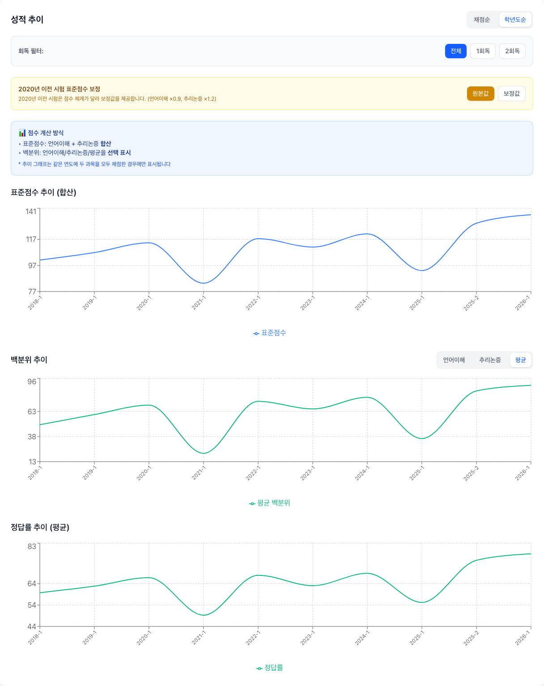

# all LEET · 올리트

리트 기출을 풀고 난 뒤, 채점부터 오답 확인과 성적 변화 분석까지 한곳에서 이어가세요.

all LEET은 법학적성시험(LEET)을 준비하는 수험생을 위한 웹 서비스입니다. 언어이해·추리논증 답안을 입력해 결과를 확인하고, 나의 기출·사설 모의고사 성적을 모아 학습 방향을 점검할 수 있습니다.

[서비스 시작하기](https://all-leet.vercel.app/) · [성적 분석 미리보기](https://all-leet.vercel.app/history) · [기출 정답표 보기](https://all-leet.vercel.app/past-exams)

## 처음이라면 이렇게 시작하세요

1. [홈 화면](https://all-leet.vercel.app/)에서 풀었던 시험의 **학년도**와 **홀수형·짝수형**을 선택합니다.
2. 언어이해·추리논증 답안에 **1~5**를 입력합니다. 한 과목만 입력해도 채점할 수 있습니다.
3. 화면 아래의 **채점하기**를 눌러 정답 수, 표준점수, 백분위와 분야별 결과를 확인합니다.
4. 기록을 남기고 싶다면 **채점 전에 로그인**하세요. 로그인한 상태에서 채점한 결과는 저장되어 성적 분석에서 다시 볼 수 있습니다.

회원가입 없이도 채점할 수 있습니다. 답안을 입력하기 전에 [성적 분석 미리보기](https://all-leet.vercel.app/history)에서 예시 그래프를 먼저 둘러봐도 좋습니다.

## 어떤 기능을 이용할 수 있나요?

| 하고 싶은 일 | 이용할 메뉴 | 로그인 여부 |
| --- | --- | --- |
| 기출 답안을 채점하고 결과 확인하기 | 채점하기 | 필요 없음 |
| 기출 정답표·점수 환산표 확인하기 | 기출문제 | 필요 없음 |
| 성적 분석 화면을 예시로 둘러보기 | 성적분석 | 필요 없음 |
| 내 채점 기록을 저장하고 다시 보기, 문항별 메모 남기기 | 채점하기 → 성적분석·결과 화면 | 필요 |
| 사설 모의고사 성적을 입력하고 추이 확인하기 | 사설입력 → 성적분석 | 필요 |
| LEET·GPA로 로스쿨 지원 가능성 살펴보기 | 합격예측 | 필요 |
| 수험생 게시글·채팅 읽기 | 커뮤니티·채팅 | 필요 없음 |
| 게시글·댓글 작성, 좋아요·신고, 채팅 참여하기 | 커뮤니티·채팅 | 필요 |

화면 하단 메뉴로 기능 사이를 이동할 수 있습니다. **성적분석**에서는 기출과 사설 성적을 탭으로 나누어 볼 수 있습니다.

## 화면으로 알아보는 이용 방법

아래 이미지는 현재 저장소의 코드로 실행한 실제 화면입니다. 성적 그래프에는 서비스가 제공하는 예시 데이터를 사용했습니다.

### 1. 기출 채점과 오답 확인

풀었던 문제지와 같은 학년도·유형을 선택한 뒤 문항 번호에 맞춰 답안을 입력하세요. 숫자를 입력하면 다음 문항으로 자동 이동합니다.

- 현재 선택할 수 있는 시험은 **2009~2026학년도와 09학년도 예비시험**입니다. 학년도에 따라 문항 수가 달라집니다.
- 두 과목을 한 번에 채점하면 종합 점수도 함께 확인할 수 있습니다.
- 결과 화면에서 내 답안과 정답을 비교하고, 분야별로 어떤 부분이 약한지 살펴볼 수 있습니다.
- 로그인했다면 결과 화면에서 문항별 메모를 남겨 다음 복습에 활용할 수 있습니다.

학년도나 홀수형·짝수형을 바꾸면 입력한 답안이 초기화됩니다. 시험 선택을 먼저 마친 뒤 답안을 입력하세요. 입력하지 않은 문항은 정답 수에 포함되지 않습니다.

### 2. 기출 정답표와 점수 환산표

[기출문제](https://all-leet.vercel.app/past-exams)에서 학년도, 과목, 시험 유형을 고르면 해당 시험의 정답을 확인할 수 있습니다.

1. 문제를 푼 뒤 **정답표·점수 환산표** 카드를 누릅니다.
2. 문항별 정답과 맞은 개수에 따른 표준점수·백분위를 확인합니다.
3. 다른 학년도·과목·유형으로 바꾸면 표가 다시 접힙니다. 필요한 때에 펼쳐 확인하세요.

일부 표준점수·백분위는 추정값이며, 환산 자료가 없는 구간은 **—**로 표시됩니다. 공식 성적과 차이가 있을 수 있으므로 참고용으로 이용하세요.

**문제지 PDF는 현재 준비 중입니다.** 정답표와 점수 환산표는 이용할 수 있지만, 문제지 열기·다운로드는 아직 제공되지 않습니다.

### 3. 나의 성적 변화 살펴보기

[성적분석](https://all-leet.vercel.app/history)의 **기출 성적 분석** 탭에서 저장된 기록과 그래프를 확인하세요. 채점순·학년도순으로 정렬하거나 회독별로 골라 볼 수 있습니다. 상세 기록의 **자세히 보기**로 답안과 결과를 다시 확인할 수도 있습니다.

그래프는 다음 기준으로 읽으면 됩니다.

- **표준점수:** 언어이해와 추리논증의 합산 점수
- **백분위:** 과목별 백분위 또는 두 과목의 평균을 선택해 표시
- **정답률:** 두 과목 정답률의 평균

기출 추이 그래프에는 **같은 학년도의 두 과목을 함께 채점한 기록**이 반영됩니다. 한 과목만 채점한 결과는 상세 기록에서 확인하세요. 두 과목의 평균 백분위는 합산 점수의 공식 백분위가 아닙니다.

아직 저장된 기록이 없으면 **예시 데이터로 미리보기 중**이라는 안내와 함께 예시 기록이 표시됩니다. 이는 내 성적이 아니며, 실제 기록이 생기면 해당 영역이 내 기록으로 바뀝니다.

2020년 이전 시험에는 원본값·보정값 전환 기능이 있습니다. 보정값은 다른 점수 체계를 비교하기 위한 참고값으로, 공식 성적이 아닙니다.

### 4. 사설 모의고사 성적 모아보기

로그인한 뒤 하단의 **사설입력** 메뉴를 이용하세요. 사설 모의고사는 답안을 자동 채점하는 기능이 아니라, 받은 성적을 직접 기록하는 기능입니다.

1. 시험일자와 시험기관을 선택합니다. 목록에 없는 기관은 직접 입력할 수 있습니다.
2. 회차는 필요한 경우 입력합니다.
3. 응시한 과목의 **표준점수와 백분위를 모두** 입력합니다. 미응시 과목은 두 항목을 모두 비워두세요.
4. 저장한 뒤 **성적분석 → 사설 성적 분석**에서 기록과 추이를 확인합니다. 시험기관별로 골라 볼 수도 있습니다.

### 5. 로스쿨 지원 가능성 참고하기

로그인한 뒤 **합격예측** 메뉴에서 언어이해·추리논증의 **합산 표준점수**와 **100점 만점 GPA**를 입력하세요. 현재 입력 화면은 정수만 받습니다.

25개 로스쿨에 대한 결과가 **적정·소신·불가**로 구분되어 표시됩니다. 학교별 비교와 영어 성적 관련 안내를 살펴보며 지원 전략을 생각해 볼 수 있습니다.

이 결과는 LEET 표준점수와 GPA를 바탕으로 한 **참고용 분석**입니다. 합격 확률이나 실제 지원 자격을 확정하는 결과가 아니며, **불가** 표시도 공식적인 지원 불가 판정을 뜻하지 않습니다. 정성평가, 면접, 영어 성적, 학교별 환산 방식 등은 충분히 반영되지 않으므로, 최종 지원 판단에는 반드시 해당 연도의 학교별 모집요강을 확인하세요.

### 6. 다른 수험생과 이야기하기

- [커뮤니티](https://all-leet.vercel.app/community)에서 태그별 게시글을 읽거나 검색할 수 있습니다. 로그인하면 이미지가 포함된 글과 댓글을 작성하고, 좋아요·신고 기능을 이용할 수 있습니다.
- [채팅](https://all-leet.vercel.app/chat)에서는 수험생들의 실시간 대화를 볼 수 있습니다. 로그인하면 자동으로 생성된 닉네임으로 참여할 수 있습니다.

게시글·댓글·채팅은 다른 이용자에게 공개됩니다. 개인정보나 타인의 민감한 정보는 올리지 마세요.

## 회원가입과 모바일 이용

### 내 기록을 남기려면

[회원가입](https://all-leet.vercel.app/signup)에서 안내에 따라 정보를 입력한 뒤, 받은 인증 이메일의 링크를 열어 인증을 완료하세요. 이후 [로그인](https://all-leet.vercel.app/login)하면 기록 저장과 회원 기능을 이용할 수 있습니다.

### 휴대폰에서 앱처럼 이용하려면

별도 앱을 다운로드하지 않아도 모바일 브라우저에서 이용할 수 있습니다. **앱 설치** 버튼 또는 브라우저의 홈 화면 추가 기능을 이용하면 홈 화면 아이콘으로 바로 접속할 수 있습니다.

iPhone·iPad는 Safari에서 공유 메뉴의 **홈 화면에 추가**를 선택하세요. 설치 방법과 버튼 노출 여부는 기기·브라우저에 따라 달라질 수 있습니다. 기록 저장·조회, 커뮤니티·채팅 등을 이용하려면 인터넷 연결이 필요하며, 오프라인 이용을 보장하지 않습니다.

## 자주 묻는 질문

### 로그인하지 않고 채점한 결과도 저장되나요?

아니요. 비로그인 상태에서는 결과 확인만 가능하고 계정에 기록이 저장되지 않습니다. 기록을 남기려면 먼저 로그인한 뒤 채점하세요.

### 성적분석에 모르는 기록이 보여요.

**예시 데이터로 미리보기 중** 안내가 있는지 확인하세요. 저장된 기록이 없는 영역에는 사용 방법을 보여주는 예시 데이터가 표시됩니다.

### 기록은 있는데 기출 추이 그래프에 나오지 않아요.

추이 그래프는 같은 학년도의 언어이해·추리논증을 함께 채점한 기록을 사용합니다. 한 과목만 채점했다면 상세 기록에서 확인하고, 그래프의 회독 필터도 확인하세요.

### 인증 이메일이 오지 않거나 비밀번호를 잊었어요.

인증 이메일은 스팸함과 입력한 이메일 주소를 먼저 확인하세요. 로그인 화면의 인증 메일 재전송 안내를 이용할 수 있습니다. 비밀번호를 잊었다면 [비밀번호 재설정](https://all-leet.vercel.app/forgot-password)에서 재설정 이메일을 요청하세요.

### 결과가 이상하거나 기록이 보이지 않아요.

먼저 학년도, 과목, 홀수형·짝수형이 맞는지 확인하세요. 기록이 보이지 않는다면 로그인한 계정과 인터넷 연결을 확인하세요. 문제가 계속되면 아래 문의 창구로 화면과 상황을 알려주세요.

## 문의와 이용 안내

홈 화면 오른쪽 아래의 **문의하기** 버튼을 이용하거나 다음 창구로 연락할 수 있습니다.

- 이메일: [all_leet@naver.com](mailto:all_leet@naver.com)
- 카카오톡: [오픈채팅 문의](https://open.kakao.com/o/swiu47fi)

정답·점수 관련 문의에는 **학년도, 과목, 홀수형·짝수형, 문항 번호 또는 맞은 개수**를 함께 적어주세요. 화면 오류는 사용한 기기·브라우저와 문제 발생 순서, 개인정보를 가린 캡처를 보내주시면 확인에 도움이 됩니다. 비밀번호나 인증 링크는 보내지 마세요.

[이용약관](https://all-leet.vercel.app/terms) · [개인정보처리방침](https://all-leet.vercel.app/privacy-policy)

개발·운영 문서와 오픈소스 고지

개발 환경과 서비스 구현 정보는 별도 문서에서 안내합니다.

- [개발 및 검증 가이드](./docs/development.md)
- [서비스 구조](./docs/architecture.md)
- [기능과 도메인](./docs/domain.md)
- [데이터베이스](./docs/database.md)
- [기출 자료 관리](./docs/past-exams.md)

사용한 제3자 소프트웨어에는 각 권리자의 라이선스가 적용됩니다. [제3자 고지](./THIRD_PARTY_NOTICES.md)와 [라이선스 준수 관리](./docs/open-source-compliance.md)에서 원문, 의존성 버전, Vercel Analytics 소스 취득 안내 및 후속 사항을 확인할 수 있습니다. 배포용 고지 텍스트는 [third-party-notices.txt](./src/public/third-party-notices.txt)입니다.

화면 캡처 및 기능 확인 기준: 2026년 9월 17일. 캡처는 로컬 실행 환경에서 운영 서비스 요청을 차단하고 촬영했으며, 실제 이용자의 계정·게시글·채팅은 포함하지 않았습니다. 배포된 서비스의 화면과 제공 자료는 이후 업데이트에 따라 달라질 수 있습니다.
