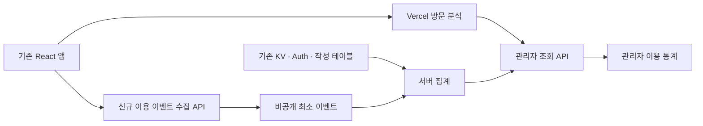

# 관리자 이용 통계 설계안

작성일: 2026-10-03 KST. 상태: **최초 출시 중심 로컬 구현 / 운영 미적용**.

검토 반영: 2026-10-03 사용자의 요청에 따라 [설계 검토 결과](admin-analytics-review.md)의 이벤트 의미·흐름 연결·세션·시간·기간 비교·수집 품질 보완안과 관리자 조회 이력을 본문에 반영했다. 구현 시 기준은 이 문서와 PWA 설계이며, 후속 개발 상태와 적용 범위는 아래 구현 상태 및 [구현·운영 문서](admin-analytics.md)를 따른다.

재검토 반영: 같은 날 확인한 세션 관찰 종료 규칙, 새 세션의 답안 입력 재개, 회원 지표 기준일 통일, 회원별 최초 이용일 요약 보존을 반영했다. 아래 시간·보존 값은 설계 제안이며 운영 설정이나 삭제 작업을 적용한 것이 아니다.

2026-10-04 통합 재검토 반영: [네 보완 항목](admin-analytics-review-20261004.md)의 일평균 곡선·윤년 경계·감소 우선 선정·인증/권한 거절 자료 제거를 설계에 반영했다. 상세 기준은 [변화 대시보드 설계](admin-dashboard-design.md) 3·4·7·8·9장과 아래 공통 API/갱신/인수 기준이다. **이번 보완은 문서 반영이며 앱·예시 HTML·운영에는 아직 미적용**이다.

추가 요구 반영: 이름을 몰라도 회원 목록을 드롭다운으로 열어 선택하는 [관리자 공통 회원 선택 설계](admin-member-picker-design.md)를 추가했다. 회원 활동·PWA 이동·조회 이력의 대상/관리자 지정에 검색과 목록 탐색을 함께 제공한다. 현재 앱·미리보기에는 아직 미구현이다.

사용자 요구는 서비스 이용·성장과 채점·학습 이용을 중심으로 **사용자들이 어떻게, 얼마나, 무엇을 사용하는지** 파악하는 것이다. 이 문서는 기능, 지표, 수집, 조회 서비스, 권한, 구현 순서를 정의한다. 아래는 전체 목표 설계다. 로컬 구현과 후속 범위의 구분은 구현 상태를 따른다.

추가 요구: **PWA를 통한 이용을 별도로 파악**한다. 실행 채널별 이용·회원 중복·설치 관측·재방문 정의는 [PWA 이용 통계 설계](admin-pwa-analytics-design.md)를 따른다. 설치 안내 클릭, 설치 이벤트, 실제 PWA 이용을 각각 구분한다.

확정된 추가 요구: **관련 이용 기록을 비식별화하지 않고, 관리자가 누가 무엇을 했는지 확인**한다. 로그인 이용 기록에는 실제 Supabase `user_id`를 유지하고 이름·이메일을 연결해 회원별 활동을 조회한다. 이전의 가명 키·HMAC 기반 식별 제안과 회원별 기록 비노출 제안은 이 요구로 대체한다. 운영 수집·회원 정보 조회·원격 DB 변경은 아직 실행하지 않았다.

## 구현 상태 (2026-10-04)

사용자가 별도 미리보기의 UI 범위를 승인했고, 1A/1B 중심의 관리자 7개 탭·회원 식별/활동·조회 감사·행동 수집·PWA·보관 현황을 로컬 구현했다. 일부 2단계인 핵심 이용 코호트·확인 후 7일 첫 채점·이력 추이/사설/지원 분석 관측도 포함했다. **원격 DB 적용·함수 배포·수집 활성화·push는 실행하지 않았다.**

실제 필터 지원 범위, 조건별 최초 상태 대신 보수적인 공통 known 플래그, UUID 순 회원 검색, 현재 KV 시각 그룹 집계, 수집 중단 가용 범위, Vercel/장기 집계/CSV/작성 관측 후속 범위는 [구현·운영 문서](admin-analytics.md)가 기준이다. 부분·미관측을 실제 0건으로 대체하지 않는다. 원본 보존·탈퇴 처리는 운영 적용 전 확정하고 자동 삭제는 추가하지 않았다.

## 1. 운영자가 답을 얻어야 할 질문

| 질문 | 필요한 분석 | 이어지는 운영 판단 |
|---|---|---|
| 이용이 늘고 있는가? | 방문자·활성 회원·신규 회원 추이 | 홍보나 기능 출시 효과 확인 |
| 무엇을 많이 사용하는가? | 기능별 이용 세션·회원·횟수 | 유지·개선할 기능 우선순위 |
| 채점을 끝까지 사용하는가? | 입력 시작/답안 재개 → 계산 완료 → 결과 조회 | 입력·결과 흐름의 이탈 개선 |
| 기출문제를 보고 채점하는가? | 기출 이용 후 같은 세션의 채점 | 기출 제공과 채점의 연결 효과 |
| 계속 돌아오는가? | 회원 D1·D7·D30 재방문, 반복 채점 | 일회성 도구와 지속 학습 도구의 구분 |
| PWA를 얼마나 사용하는가? | PWA 이용 세션·회원·기능·재방문, 브라우저와 비교 | 설치형 이용과 학습 지속성 파악 |
| 누가 어떤 기능을 사용했는가? | 이름·이메일로 찾는 회원별 활동 기록과 채널 이력 | 개별 이용 흐름·오류 상황 확인 |
| 오류 때문에 이용을 포기하는가? | 저장 확인 실패·조회 실패와 전환 변화 | 실제 장애와 낮은 이용률 구분 |

주요 성과 지표는 **주간 채점 이용 회원 수**와 **채점 결과 조회 세션 수**로 제안한다. 첫 지표는 지속적인 회원 이용, 두 번째는 비로그인 이용까지 포함한 도구 활용을 보여 준다. 사이트 방문과 실제 학습 행동은 각각 표시한다.

## 2. 현재 구현과 원격 데이터에서 확인한 사실

확인 근거: `src/App.tsx`, `src/pages/AdminPage.tsx`, `src/pages/HomePage.tsx`, `src/hooks/useUserHistory.ts`, `src/contexts/AuthContext.tsx`, 기출·커뮤니티 구현, 관련 문서와 2026-10-03 운영 DB 메타데이터 읽기 전용 조회. 개인 행·답안·회원 정보를 다운로드하지 않았다.

- `/admin`은 공지 관리 진입 메뉴이고 `/admin/announcements`가 구현되어 있다. `AdminRoute`와 `AuthContext`의 관리자 확인을 재사용할 수 있다.
- 관리자 역할은 `private.admin_roles`, 자기 권한 확인 RPC는 `public.current_user_is_admin()`이다. 원격에서는 `private.admin_roles`의 직접 접근 차단 정책을 확인했다.
- `App.tsx`에 Vercel `<Analytics />`가 연결되어 있다. 실제 프로젝트의 Analytics 활성화 상태·플랜·보존 기간·API 권한·수집량은 이번 작업에서 확인하지 않았다.
- 코드 검색에서 기능 사용 `track()` 호출과 `analytics_events` 사용은 확인되지 않았다. 운영 스키마의 컬럼 목록에도 해당 테이블이 없다.
- 운영에 `public.analytics_summary(start_ts, end_ts)`가 남아 있다. 정의는 `public.analytics_events`에서 이벤트별 건수만 조회하지만 해당 관계는 현재 메타데이터에서 확인되지 않는다. 관리자 검사도 포함하지 않는다. **호출하거나 정상 통계 API로 가정하지 않으며**, 향후 정리·권한 변경은 별도 검토한다.
- 공식 이력은 KV의 `history:<userId>` JSON 배열이다. 한 번 두 과목을 채점하면 과목별 기록 두 개를 `groupTimestamp`로 묶는다. 비로그인 채점은 이력을 저장하지 않는다.
- 사설 이력은 `mock_history:<userId>` 배열이고, `examDate`와 입력 시점 `createdAt`은 다르다.
- KV에는 `key`, `value`만 있다. 저장 성공 시각·삭제 시각을 별도로 기록하는 이벤트 로그는 없다. 기록의 `timestamp`는 브라우저에서 생성한다.
- 커뮤니티·채팅·메모에는 사용자 식별자와 생성 시각이 있다. 현재 남아 있는 작성 활동은 집계할 수 있지만 삭제된 활동이나 읽기 이용은 복구할 수 없다. 게시글 `views_count`는 고유 방문자 수가 아니다.
- 문항 통계는 공개 발행 스냅샷이다. 현재 이용량이나 최근 채점 활동을 실시간으로 나타내지 않는다. 원본 기준 시각과 발행 시각이 따로 있다.
- 이번 원격 조회에서 기존 public/private 테이블의 RLS 활성화를 확인했다. 로컬 파일과 원격 마이그레이션 목록·일부 버전은 여전히 같지 않다.

**기존 데이터로 확인할 현황**과 **수집 개시 이후의 실제 행동 통계**를 함께 제공하되, 화면에서 출처와 기간을 구분한다. 과거 이벤트가 없는 구간을 0으로 채우지 않는다.

## 3. 관리자 기능과 화면 제안

`/admin`에 **이용 통계** 메뉴 하나를 추가하고 `/admin/analytics` 안에 개요·기능·채점·회원/재방문·회원 활동·PWA·관리자 조회 이력의 일곱 탭을 둔다. PWA 상세 비교 영역은 별도 설계를 따른다. 기존 공지 관리와 일반 사용자 화면은 유지하는 제안이다. 해당 UI 범위는 사용자 승인 후 로컬 적용했다.

### A. 개요

2026-10-04 추가 요구인 **한눈에 최근 변화를 확인하는 대시보드**는 [변화 대시보드 설계](admin-dashboard-design.md)에서 구체화했다. 기존 개요 확장 제안이며 아래 전체 목표 목록 중 최초 제공 카드는 새 설계를 따른다. 최근 완료된 7일/직전 기간, 주요 변화 최대 3개, 기능별 행동 변화, PWA, 최근 실제 회원 활동, 오늘 잠정 현황을 구분한다. 카드의 기간 DISTINCT는 유지하고 곡선은 일평균으로 표시하며 자료가 빠진 구간은 선을 끊는다. 충분한 표본의 채점 관측률 감소는 주요 변화 첫 자리를 확보한다. 문서·분리된 미리보기만 추가했으며 실제 앱 UI/API/DB는 미변경이다. 이번 보완 기준은 예시 HTML에도 아직 미반영이다.

- 핵심 카드: 방문자(Vercel 기준), 활성 회원, 신규 확인 회원, 채점 결과 조회 세션, 채점 계산 완료 횟수, 회원 D7 재방문율.
- 일별 추이: 방문, 활성 회원, 채점 이용. 단위가 다른 지표는 각각의 그래프로 제공한다.
- 기능 이용 순위: 기출 열람, 채점, 결과 조회, 이력·추이 조회, 문항 응답 분포, 사설 이력, 지원 분석, 커뮤니티, 채팅.
- 주요 전환: 채점 입력을 시작하거나 답안을 재개한 관찰 종료 세션 중 같은 흐름의 결과를 본 세션 비율.
- PWA 요약: 이용 세션·활성 회원·채점 완료 횟수와 브라우저 대비 비중. 세부 내용은 PWA 분석 영역으로 이동한다.
- 데이터 상태: 수집 시작일, 마지막 정상 집계 시각, 지연·누락·표본 부족 안내.
- 데이터 상태는 서버가 관측한 제출·수락·중복·거절·실패 및 집계 지연을 제공한다. 전송되지 않은 이벤트의 전체 누락률은 측정 불가로 구분한다.

운영자는 개요에서 변화를 발견하고 해당 기능·채점·회원 탭의 동일한 기간으로 이동한다. 자동 원인 단정 대신 비교 가능한 수치와 출처를 제공한다.

### B. 기능 이용

각 기능의 **화면 진입**과 **실제 행동**을 나란히 보여 준다. 페이지뷰만으로 기능 사용을 판정하지 않는다.

| 기능 | 화면 진입 | 실제 이용 행동 | 상세 분석 |
|---|---|---|---|
| 공식 채점 | 홈 진입 | 첫 답안 입력·계산 완료 | 학년도·과목 조합·문형·로그인 상태 |
| 기출문제 | 기출 화면 진입 | PDF 열기·다운로드 링크 클릭 | 학년도·과목·문형, 이후 채점 여부 |
| 정답표·환산표 | 기출 화면 진입 | 표 펼치기 | 어떤 자료를 함께 사용하는지 |
| 문항 통계 | 결과/정답표 진입 | 응답 분포 모달 열기 | 진입 위치·시험 조합별 사용량 |
| 공식·사설 이력 | 이력 화면 진입 | 이력 정상 조회·추이 조회 | 이용 회원·반복 조회·기관 분포 |
| 사설 기록 입력 | 입력 화면 진입 | 저장 성공 확인 | 입력 → 저장 확인 전환 |
| 지원 분석 | 입력 화면 진입 | 계산 완료·결과 조회 | 실제 계산 이용률 |
| 커뮤니티 | 목록 진입 | 상세 조회·작성 성공 확인 | 읽기와 쓰기의 이용 차이 |
| 채팅 | 채팅 화면 진입 | 초기 메시지 조회·전송 성공 확인 | 조회와 전송의 이용 차이 |

PDF 링크 클릭은 **다운로드 의도**로 이름 붙인다. 브라우저·Storage에서 실제 파일 저장 완료를 확인하는 기능은 없으므로 완료 건수로 표시하지 않는다. 채팅 화면 진입·메시지 로딩도 실제 읽음을 보장하지 않는다.

기능별 표에는 이용 세션, 이용 회원, 행동 횟수, 세션당 평균 횟수, 이전 기간 대비 변화를 둔다. 여러 기능을 쓰는 세션이 있으므로 기능별 세션 수의 합은 전체 세션 수보다 클 수 있다.

### C. 채점 이용

- 공식 채점 흐름: 첫 답안 입력/새 세션의 답안 재개 → 유효한 채점 요청 → 계산 완료 → 결과 화면 정상 표시.
- 입력 흐름과 채점 실행을 연결해 답안 초기화·시험 변경·재채점·새 세션에서의 답안 재개를 구분한다. 전환율은 관찰이 종료된 세션을 대상으로 하고 진행 중·관찰 미확정 세션은 따로 표시한다. 결과를 보지 않은 세션은 **결과 조회 미관측**으로 표시한다. 관찰 종료는 실제 이용 종료를 증명하는 값이 아니다.
- 저장 흐름은 로그인 이용자만 별도로 분석: 저장 시도 → 성공 응답 확인 / 실패 응답 / 응답 미확인.
- 로그인·비로그인 비중, 언어이해·추리논증·두 과목 동시 채점 비중.
- 학년도·문형별 이용 횟수와 이용 회원, 재채점·회독 분포.
- 기출 PDF/정답표 이용 → 같은 세션에서 채점 결과 조회 비율.
- 결과 조회 이후 문항 통계·이력·메모 이용 비율.
- 현재 보관된 공식 이력 과목별 건수, 묶음 수, 이력 보유 회원 수. 행동 이벤트 차트와 다른 영역에 배치한다.

점수 평균·백분위 분포는 후속 선택 기능이다. 핵심 목적이 이용 분석이므로 최초 범위에서는 개인 점수·답안의 추가 수집 없이 구현한다. 나중에 도입해도 저장 이용자의 자발적 표본이라는 한계를 표시하고 실제 LEET 응시자 전체와 비교하지 않는다.

### D. 회원·재방문

- 현재 계정 수, 확인 완료 회원 수, 기간 내 가입 및 확인 완료 추이.
- 로그인 회원 DAU/WAU/MAU와 주간 핵심 기능 이용 회원 수.
- 신규 확인 회원의 첫 채점 이용률, 계정 확인 완료 후 7일 내 첫 채점까지 걸린 시간 구간. 가입일은 계정 현황용이며 이 전환의 기준일과 구분한다.
- 최초 핵심 이용일 기준 D1·D7·D30 재방문 코호트. 서비스 전체는 기출·이력 등 4장의 핵심 이용 전체를 기준으로 하며 최초 채점일 코호트로 바꾸어 표시하지 않는다.
- 같은 기간에 채점 1회 / 2~4회 / 5회 이상 이용한 회원 분포.
- 회원 중 이력 저장·추이 조회까지 사용하는 비율.

집계에서 해당 조건으로 이용한 회원 목록과 회원별 활동으로 이동한다. 이름·이메일·실제 `user_id`로 회원을 식별한다. 비로그인 이용은 세션 단위로 측정하며, 브라우저 간 동일 인물 여부나 장기 재방문은 추정하지 않는다.

### E. 회원별 활동

**회원 목록 → 회원 선택 → 기간별 활동 타임라인** 흐름을 최초 출시 범위에 포함한다.

- 회원 검색: 이름·이메일·회원 UUID. 이름이 없거나 같은 회원은 이메일과 UUID로 구분한다. 이름은 계정에 입력된 표시 이름이며 신원 인증을 뜻하지 않는다.
- 회원 선택: 검색어 없이도 드롭다운에서 일반 회원 전체를 가입 최신순으로 50명씩 탐색하고 선택한다. 이름·이메일·가입일·UUID 확인을 제공하며 활동 없는 계정도 포함한다. 선택 목록에는 기간/채널 필터를 암묵적으로 적용하지 않고 선택 후 개인 기록에 적용한다. 공통 선택·해제·오류·페이지 기준은 [회원 선택 설계](admin-member-picker-design.md)를 따른다.
- 목록: 이름, 이메일, 회원 UUID, 가입일, 마지막 관측 이용일, 기간 내 이용 세션·채점 완료·기출 이용 수, PWA/브라우저 이용 여부. 활동 없는 계정과 조회 오류를 구분한다.
- 상세: 회원 식별 정보와 함께 시간순으로 **언제 / 어느 채널에서 / 어떤 기능을 / 어떤 대상으로 / 어떤 결과로** 이용했는지 보여 준다.
- 대상: 채점 학년도·과목 조합·문형, 기출 파일, 정답표·환산표, 문항 번호, 공식/사설 이력 구분, 사설 기관·회차, 게시글 ID 등 해당 기능을 구분하는 구조화 값.
- 결과: 계산 완료, 조회 완료, 저장 응답 성공 확인, 실패 응답, 응답 미확인. 클라이언트 관측과 서버 확인 이벤트의 출처도 표시한다.
- 시각: 클라이언트가 기록한 **관측된 활동 시각**과 서버 수신 시각을 구분한다. 지연·시각 검증 실패를 표시하고 수신 시각을 실제 조작 시각처럼 이름 붙이지 않는다.
- 필터: 회원, 기간, 기능, PWA/브라우저, OS·기기, 처리 결과. 최근 활동순 기본 정렬과 커서 기반 페이지 구분을 제공한다.
- 같은 회원의 브라우저/PWA 이용은 실제 `user_id`로 통합하고 각 행에 채널을 표시한다. 세션 경계와 로그인 계정 변경은 유지한다.
- 기출·문항·게시글 등 대상이 삭제되거나 버전이 달라지면 이벤트에 남은 식별 정보와 당시 버전을 표시하고 현재 대상 조회와 구분한다.
- 비로그인 기록은 `비로그인 · 세션 …`으로 표시한다. 이름·이메일을 알 수 없는 상태를 실제 회원으로 만들어 표시하지 않는다.

표시 예시(실제 회원 데이터가 아닌 설명용 예):

| 시각(KST) | 회원 | 실행 채널 | 활동 | 대상·결과 |
|---|---|---|---|---|
| 10:00 | 예시회원 / member@example.com | PWA | 기출 PDF 열기 | 2027 언어이해, 링크 클릭 관측 |
| 10:08 | 같은 회원 | PWA | 채점 계산 완료 | 2027 두 과목, 실행 1회·과목 2건 |
| 10:08 | 같은 회원 | PWA | 공식 이력 저장 | 언어이해 성공 응답 확인 |
| 10:09 | 같은 회원 | PWA | 문항 응답 분포 조회 | 언어이해 3번 |

이용 행동을 회원과 연결하는 설계이며, 답안·메모·채팅 본문을 이벤트에 복사하는 기능은 포함하지 않는다. 식별 정보는 관리자 전용 API에서 반환하고 일반 이용자 화면이나 공개 문항 통계 응답에 추가하지 않는다.

### 관리자 회원 기록 조회 이력

회원 검색·목록·상세·비로그인 세션 기록을 제공한 관리자 API 요청을 서버에서 기록한다. 관리자에게 어느 운영자가 어느 회원의 기록을 언제 조회했는지 확인하는 조회 이력 기능을 제공한다. 기존 관리자 인가를 적용하며, 이용자 행동 통계와 분리한다.

- 필드: 서버가 검증한 관리자 `user_id`, 대상 종류와 회원 `user_id`/세션 ID, 조회 종류·기간·허용된 필터·서버 시각·반환 건수·응답 제공 상태.
- 회원 검색은 검색 종류와 검색 수행 여부를 기록하고 이름·이메일 검색어를 별도 원본 로그에 복사하지 않는다. 회원 목록의 검색 조건으로 선택된 모든 사람을 실제 상세 조회 대상처럼 기록하지 않는다.
- 서버 캐시 응답을 반환한 요청에도 기록한다. 브라우저 메모리에 이미 받은 내용을 다시 보여주는 것은 별도 API 접근이 아니므로 새 조회로 세지 않는다.
- 기록은 관리자 API 접근/응답 제공 사실이다. 운영자가 화면을 실제 읽었다거나 파일을 내려받았다는 의미로 표시하지 않는다.
- 조회 이력 필터는 관리자·대상 회원·기간·조회 종류로 제공한다. 서버 전용 추가만 허용하고 브라우저에서 생성·수정·삭제하지 못하게 한다. 이 이력의 조회도 같은 관리자 API 접근 기준으로 기록하며 조회 자체가 무한 추가 조회를 일으키지 않게 요청당 한 번 기록한다.
- 관리자·대상 회원 필터는 공통 검색형 선택 목록을 제공하고 UUID 직접 입력도 유지한다. 감사 목록에는 기록에 남은 과거 UUID를 포함하여 역할 회수·계정 연결 불가 후에도 가용 이력을 찾을 수 있게 한다. 현재 이름/역할과 조회 당시 정보를 혼동하지 않는다. 선택 목록 요청도 개인 목록 조회로 감사하며 각 옵션을 상세 조회한 것으로 기록하지 않는다.

### 공통 조회 기능

- 기본 최근 7개 완료일, 빠른 선택 7/30/90일 및 직접 기간. 오늘은 별도 선택하고 진행 중임을 표시한다.
- 이전 동일 길이 기간 비교는 양쪽 기간이 같은 정의·필터로 완전히 조회될 때만 제공한다. 이전값이 실제 0이면 증가율은 `—`, 절대 증감은 표시한다. 비교 데이터가 없거나 일부만 보존된 경우 0으로 채우지 않고 비교 불가/일부 기간으로 표시한다.
- 일/주 단위, 로그인 상태, 기능, 채점 학년도·과목 조합·문형 필터. 적용 가능한 필터만 제공한다.
- 시험 필터의 기능 이용률 분모는 해당 시험 입력·선택이 관측된 세션이다. 시험 정보가 없는 전체 페이지뷰를 분모에 섞지 않는다. 모든 지표에 같은 필터가 적용된다고 가정하지 않고 적용 범위를 함께 표시한다.
- 실행 채널 `전체 / PWA / 브라우저 / 기타·판별 불가`, OS·기기 유형 필터를 추가한다. PWA는 모바일과 PC를 모두 포함하며 자체 행동 수집 지표에 적용한다. Vercel 방문 지표는 채널 식별 연동을 별도 검증하기 전까지 전체로만 표시한다.
- 관리자·승인된 테스트 계정·개발/preview 환경을 제외한 운영 이용이 기본값이다.
- 필터는 URL에 복원하되 계정 식별자·비밀값을 넣지 않는다.
- 집계표 CSV 내보내기는 후속 기능. 원본 이벤트나 회원·답안·점수 목록은 내보내지 않는다.

## 4. 지표 정의와 계산 기준

| 지표 | 정의 | 유의점 |
|---|---|---|
| 방문자 | Vercel Analytics가 정의한 선택 기간의 방문자 수 | 회원 수·고유 인물 수와 동일하지 않음 |
| 이용 세션 | 자체 행동 수집의 서로 다른 `session_id` 수 | 30분 활동 없음으로 종료, 저장소·실행 채널별 구분 |
| 활성 회원 | 기간 내 허용된 이용 이벤트가 있는 검증된 회원의 고유 수 | 로그인 성공만으로 활성 판정하지 않음 |
| DAU/WAU/MAU | KST 하루/조회 종료일 기준 최근 7일/최근 30일 활성 회원 고유 수 | 일별 DAU를 합쳐 WAU/MAU로 계산하지 않음 |
| 기능 이용률 | 같은 조건의 전체 이용 세션 중 해당 기능 행동이 있는 세션 비율 | 횟수와 이용 세션 비율을 구분 |
| 채점 완료 횟수 | 성공한 로컬 계산의 서로 다른 `grading_run_id` 수 | 두 과목을 동시에 계산해도 1회 |
| 과목별 계산 건수 | 완료된 실행에 포함된 과목 수의 합 | 두 과목 동시 계산은 2건 |
| 채점 결과 조회율 | 입력 시작 또는 답안 재개가 조회 기간에 속하는 관찰 종료 세션 중 같은 세션·흐름의 실행 결과를 본 세션 비율 | 진행 중·관찰 미확정 세션, 결과 직접 진입·과거 이력 조회는 제외 |
| 실행별 계산 완료율 | 유효한 채점 요청 실행 중 로컬 계산 완료가 관측된 실행 비율 | 입력 시작 세션의 전환율과 분모가 다름 |
| 저장 성공 확인율 | 로그인 상태의 저장 시도 과목 건수 중 성공 응답을 확인한 과목 건수 비율 | 응답 미확인을 확정 실패로 단정하지 않음 |
| 첫 채점 전환율 | 관찰 기간이 끝난 신규 확인 회원 중 확인 후 7일 내 채점 완료 회원 비율 | 아직 7일이 지나지 않은 회원은 분모에서 제외 |
| D7 재방문율 | 최초 핵심 이용일이 D인 회원 중 D+7 KST 날짜에 다시 핵심 이용한 회원 비율 | 7일 내 재방문율과 다른 지표 |
| 현재 보관 이력 | 집계 시점 KV에 남은 유효한 기록 수 | 누적 전체 채점·저장 성공 수가 아님 |

핵심 이용은 채점 계산 완료, 기출 자료 이용, 정상 이력 조회, 사설 저장 성공 확인, 지원 분석 완료 중 하나로 시작한다. 정의는 `metric_version`으로 관리한다. 정답 모달 조회·커뮤니티·채팅 등은 전체 활성 회원에는 포함하지만 핵심 재방문과 별도로 비교한다.

회원 전환의 시작점은 계정 확인 완료 시각이며, 첫 채점은 확인 후 처음 관측된 `grading_completed`의 서버 수신 시각이다. 확인 후 7일은 `[확인 완료 시각, 확인 완료 시각 + 7×24시간)`으로 계산하고 구간 끝이 관측 자료의 기준 시각을 넘지 않는 회원만 분모에 넣는다. 서비스 재방문의 기준일은 최초 핵심 이용의 KST 수신 날짜다. PWA 재방문은 최초 PWA 핵심 이용일을 기준으로 한다. 최초 채점일·최초 PWA 이용일은 별도 요약 값이며 이 재방문 기준을 대신하지 않는다.

최초 이용일은 보존된 활동일의 MIN을 매번 계산해 갱신하지 않는다. 7장의 회원 최초 이용 요약에 실제 회원 ID·지표 버전별 최초 시각을 유지한다. 요약이 없고 이전 구간을 복원할 수 없으면 최초 여부를 `unknown`으로 반환하고 최초 이용에 따른 신규 분류·코호트에 포함하지 않는다. 계정 생성/확인 기록으로 산출하는 신규 계정 수는 이 제외 조건과 별개다. 최초 시각을 알아도 D+7/D+30 활동 자료가 없으면 재방문 여부는 자료 없음이며 0으로 처리하지 않는다.

기존 공식 이력 묶음은 사용자 + 유효한 `groupTimestamp`로 구분한다. 값이 없는 과거 기록은 과목별 기록으로 남기고 묶음 수 산출에서는 미확인 건수로 따로 표시한다. 비슷한 시각을 근거로 임의 결합하지 않는다. 같은 회원이 여러 번 채점한 기록은 그대로 여러 이용으로 센다.

모든 시간 필터는 KST `[시작일 00:00, 종료일 다음 날 00:00)`를 UTC로 변환해 적용한다. 최초 이벤트의 일별 집계·회원 활동일·재방문은 서버 `received_at` 기준으로 계산하고 화면에도 수신 기준임을 표시한다. 사설 기존 보관 기록의 입력 시점 분포는 `createdAt`, 응시일 분포는 `examDate`를 사용한다. 기존 클라이언트 기록 시각, 새 이벤트의 수신 시각, 회원 타임라인의 관측 활동 시각을 구분한다.

기간 전체의 회원·세션·채점 실행 수는 각 ID를 전체 조회 범위에서 DISTINCT 처리한다. 일별 고유 수를 합산하지 않는다. 같은 세션이 자정을 넘어 양쪽 날짜에 나타나도 전체 기간에는 한 번만 센다. 로그인 여부가 바뀐 세션은 로그인/비로그인 부분집합에 모두 등장할 수 있으므로 두 부분집합의 합을 전체 세션 수와 같다고 주장하지 않는다.

지표별 `available_from`, `available_through`, `coverage_status=complete|partial|unavailable`을 반환한다. 수집 시작일·보존 기간·집계 정의 버전이 다르면 가용 구간도 달라진다. 기간 비교는 두 구간의 동일 정의·동일 필터·완전한 자료가 확인된 경우에만 계산한다. 예를 들어 원본 90일만 보존되어 있으면 세션·실행 지표의 최근 90일 대 이전 90일 비교는 제공하지 않는다. 장기 집계로 복원할 수 있는 가산 가능한 행동 횟수는 별도 가용 범위를 표시한다.

0건·수집 전·조회 오류·집계 지연·표본 부족은 서로 다른 상태다. 회원 코호트의 분모가 10명 미만이면 건수·비율과 함께 표본이 적다는 안내를 표시한다. 관리자용 회원 목록·활동 기록은 표본 크기로 숨기지 않는다. 이는 기존 공개 문항 정답률의 30건 이하 안내·공개 정책을 변경하지 않는다.

## 5. 추천 서비스 구성

**Vercel은 방문·유입 분석, 자체 Supabase 수집은 기능 사용·순서·회원 재방문, 기존 데이터는 보관 현황**을 담당한다.

누가 이용했는지 확인하는 회원별 기록은 자체 Supabase 이벤트에 실제 `user_id`를 저장해 제공한다. 이름·이메일 조회도 이 서버 경계에서 수행하고 Vercel 방문 집계에 회원 신원이 연결되어 있다고 가정하지 않는다.

이 구성은 SPA를 유지하고 새로운 서버 플랫폼을 도입하지 않는다. 별도 수집 Edge Function과 관리자 조회 Edge Function을 제안하며 기존 이력 함수와 배포·장애 범위를 분리한다. 함수 추가·설정·배포는 이번 작업에서 실행하지 않는다.

Vercel은 현재 공식 문서에 페이지뷰·방문자·이벤트 집계 API를 제공한다. API 사용에는 프로젝트 활성화, access token, 프로젝트/팀 식별값이 필요하다. 서버가 정해진 집계만 요청하고 토큰은 브라우저에 전달하지 않는다. 플랜의 보고 기간·실제 권한을 먼저 검증하고, 연동 불가 시 외부 대시보드로 확인하는 대안을 둔다. [공식 API 문서](https://vercel.com/docs/analytics/web-analytics-api)

기능 이벤트를 Vercel `track()`으로만 수집하는 단순 대안도 있다. 다만 custom events는 현재 Pro/Enterprise 대상이고, 집계 건수만으로 동일 세션의 단계 순서·회원 코호트를 재구성할 수 있다고 가정하지 않는다. 추천안에서는 자체 행동 이벤트를 기준으로 삼고 중복 수집을 피한다. [Custom events 문서](https://vercel.com/docs/analytics/custom-events)

Vercel 방문자와 자체 세션은 별개의 모수다. 두 출처의 수를 합치거나 Vercel 방문자를 자체 채점 전환율의 분모로 쓰지 않는다. 채점 전환은 동일한 자체 세션·관찰 기간·필터 안에서 계산한다.

## 6. 최소 이벤트 수집 계약

무차별 클릭·스크롤·키 입력을 수집하지 않는다. 최초 답안 입력, 자료 열기, 계산 완료, 조회 완료처럼 운영 질문에 필요한 단계만 기록한다.

| 이벤트 제안 | 발생 기준 | 중복 처리 |
|---|---|---|
| `page_view` | 사용자 화면의 라우트가 실제 표시됨 | 같은 페이지 진입 ID는 한 번 |
| `grading_input_started` | 비어 있던 답안에 최초 유효 답안 입력 | 입력 흐름 ID당 한 번 |
| `grading_input_resumed` | 새 세션 또는 계정 경계에서 남아 있는 유효 답안을 실제 수정하거나 채점 요청함 | 새 입력 흐름 ID당 한 번, 채점 실행을 추가하지 않음 |
| `grading_requested` | 유효 답안으로 채점 실행을 시작함 | 채점 실행 ID당 한 번 |
| `grading_completed` | 로컬 계산이 성공함 | 채점 실행 ID당 한 번, 과목 조합 포함 |
| `grading_result_viewed` | `entry_source=new_grading`이고 새 계산 실행과 연결된 정상 결과가 표시됨 | 채점 실행 ID당 한 번 |
| `past_result_viewed` | `entry_source`가 `history` 또는 `example`인 과거·예시 결과가 정상 표시됨 | 페이지 진입 ID당 한 번, 새 채점에 포함하지 않음 |
| `history_save_outcome` | 과목별 저장 응답 또는 미확인 상태를 판정함 | 저장 시도 ID + 과목당 한 번 |
| `past_exam_file_clicked` | PDF 열기/다운로드 링크 클릭 | 실제 클릭마다 새 이벤트 ID |
| `reference_opened` | 접힌 정답표/환산표가 열림 | 실제 열기 동작마다 새 이벤트 ID |
| `question_distribution_opened` | 문항 응답 분포가 열림 | 실제 열기 동작마다 새 이벤트 ID |
| `history_viewed` | 해당 공식/사설 이력 화면이 표시되고 조회 상태가 정상임 | 공식/사설 + 페이지 진입 ID당 한 번 |
| `mock_saved` | 사설 이력 저장 성공 응답을 확인함 | 저장 시도 ID당 한 번 |
| `admission_completed` | 지원 분석 계산이 성공함 | 계산 실행 ID당 한 번 |
| `community_post_viewed` | 게시글 조회 성공 후 상세가 표시됨 | 페이지 진입 ID당 한 번 |
| `chat_loaded` | 채팅 초기 조회가 성공함 | 페이지 진입 ID당 한 번 |
| `operation_outcome` | 메모·작성·전송 등 대상 작업의 응답을 확인함 | 작업 시도 ID당 한 번 |

공통 값은 서버 생성 `received_at`, 클라이언트 관측 `occurred_at`, 문서별 `page_instance_id`와 증가하는 `event_sequence`, 이벤트 ID·버전·이름, 세션 ID, 서버가 검증한 실제 `user_id`(비로그인은 null), 로그인 여부, 정규화한 기능·라우트, 검증된 환경·앱 버전이다. 선택 값은 학년도·과목 조합·문형·문항 번호, `entry_source`, 기관의 허용 목록 값·회차, `input_flow_id`·`previous_input_flow_id`·`resume_reason`·`grading_run_id`·저장 시도 ID, 허용된 `target_type`·`target_id`, 제한된 결과/오류 코드다. 관련 대상을 확인할 수 있게 구조화된 ID를 유지하되 전체 URL·본문을 저장하지 않는다.

### 실제 화면 이용과 진입 출처

`App.tsx`는 화면과 무관하게 `useUserHistory`로 이력을 미리 읽는다. 공통 조회 함수의 성공에 `history_viewed`를 붙이지 않고 해당 이력 페이지가 실제 정상 표시될 때 계측한다. 빈 이력도 정상 화면 이용에 포함하되 기록 보유 회원 수와 구분한다.

결과의 `entry_source`는 `new_grading|history|example|unknown`으로 고정한다. `HomePage`의 새 계산, `HistoryPage`의 과거 결과 이동, 예시 결과 이동에서 실제 구현 때 navigation state 등 내부 정보를 전달한다. 현재 코드에 이 필드가 이미 있다고 가정하지 않는다. 결과 데이터가 없거나 출처를 확인하지 못한 진입은 새 채점 결과 조회에 포함하지 않는다. 정상 과거 결과 조회는 회원별 활동에 남기지만 새 계산 횟수·입력 전환율을 늘리지 않는다.

### 입력 흐름·실행·완료 관찰

- 첫 유효 답안 입력에서 `input_flow_id`를 만든다. 학년도·문형 변경, 전체 답안 초기화, 새 입력 흐름 시작에서 기존 흐름을 종료한다. 일부 답안 수정은 같은 흐름이다.
- 30분 비활동·실행 채널 변경·저장소 연결 실패로 세션이 바뀌면 기존 흐름을 현재 세션에 재사용하지 않는다. 유효 답안이 남아 있으면 다음 실제 답안 수정 또는 유효 채점 요청 직전에 새 `input_flow_id`를 만들고 `grading_input_resumed`를 기록한다. 빈 답안은 다음 첫 입력에서 `grading_input_started`를 기록한다. 답안 자체는 유지하며 단순 복귀·렌더만으로 재개 이벤트를 만들지 않는다.
- 재개 이벤트의 `resume_reason`은 `session_changed|identity_changed`다. 같은 계정 또는 계속 비로그인인 동일 저장소·채널에서 이전 흐름을 확인한 경우만 `previous_input_flow_id`를 연결한다. 로그인·로그아웃·다른 계정 전환에서는 새 흐름을 만들고 이전 흐름 ID를 전달하지 않는다. 이전 익명·다른 회원의 기록을 새 회원에게 소급 귀속하지 않는다. 저장소가 분리된 PWA와 브라우저의 흐름도 임의 연결하지 않는다.
- 재개는 해당 새 세션의 입력 단계로 한 번 포함하고 시작/재개별 분포를 따로 제공한다. 새 실행과 결과는 새 흐름·현재 세션에만 연결하며 이전 세션의 미관측 결과를 성공으로 바꾸지 않는다. 같은 세션에 시작/재개/여러 흐름이 있어도 세션 분모는 한 번만 센다.
- 유효한 채점 요청마다 새 UUID `grading_run_id`를 만들고 현재 입력 흐름 ID와 연결한다. 계산·과목별 저장 시도·결과 화면에 같은 실행 ID를 전달한다. 기존 이력의 `groupTimestamp`는 변경하지 않는다.
- 같은 입력을 다시 채점하면 새 실행 1회다. 세션 전환율은 해당 입력 흐름에서 결과를 본 세션을 한 번만 세고, 실행별 계산 완료율은 요청 실행을 각각 분모로 센다.
- 채점 전환의 기간 소속은 같은 세션에서 최초로 관측된 입력 시작/재개 이벤트의 수신 시각으로 정한다. 필터를 적용하면 해당 조건에 맞는 입력 단계만 기준으로 한다. 같은 세션의 결과가 조회 종료일 이후에 발생해도 확보된 관찰 범위 안에서 연결한다. 실행 ID가 같지 않은 다른 결과로 입력 단계를 완료 처리하지 않는다.
- 결과 관찰의 분모는 아래 서버 규칙에 따라 관찰 종료된 세션이다. 진행 중·지연 유예 중과 알려진 수집 장애로 관찰 미확정인 세션은 별도로 반환한다. 상태 전송이 조용히 멈췄다는 이유만으로 영구 미확정으로 두지 않는다. 수집 지연·늦은 이벤트로 결과가 추가되면 해당 기간을 재집계한다.
- 결과 이벤트가 없으면 **결과 조회 미관측**이다. 수집 누락 가능성이 있으므로 의도적 포기를 확정하지 않는다.

### 세션 활동과 시간 계약

- 서버에 보낸 이벤트 간격을 사용자의 비활동으로 간주하지 않는다. 화면이 보이는 동안 실제 답안 변경·선택·기능 조작이 있으면 로컬 `last_interaction_at`을 갱신한다. 서버에 개별 입력·클릭을 기록하지 않는다.
- 서버의 완료 관찰에도 필요한 최소 상태는 `session_activity`로 요약해 전송한다. 실제 조작이 있을 때 최대 분당 한 번, 이후 실제 기능 이벤트와 함께 마지막 활동 상태를 전달한다. 원본 조작·답안은 보내지 않으며, 이 상태는 기능 사용·페이지뷰·활성 회원·핵심 재방문 횟수를 늘리지 않는다. 조작 없이 열린 탭에는 반복 전송하지 않는다.
- 상태 요약에는 세션·문서 ID, 증가하는 활동 순서, 직전 조작의 관측 시각을 포함하고 서버는 수신 시각도 유지한다. 로컬 세션 분리의 30분 규칙과 서버의 관찰 종료 규칙은 서로 다른 값이다. 서버는 문서별 새 이용 이벤트·새 활동 상태의 수신 시각 중 최댓값을 세션의 `last_activity_received_at`으로 유지한다. 단순 재시도·중복 이벤트·포커스·설치 신호는 이 값을 연장하지 않는다.
- 서버 관찰 상태는 `open|grace|observation_closed|uncertain`으로 제안한다. 마지막 활동 수신 후 30분 미만은 open, 이후 15분은 전송 지연 유예인 grace, 총 45분 동안 새 활동이 없고 알려진 수집 장애가 없으면 observation_closed로 판정한다. 모든 공유 탭의 상태를 합쳐 판단하며 클라이언트의 종료 이벤트를 필수로 요구하지 않는다. 15분 유예는 조정 가능한 제안이고 변경 시 지표 버전을 갱신한다.
- 서버가 확인한 저장/처리 장애, 도달한 미전송·순서 누락 보고, 무효 활동 상태 등으로 관찰을 신뢰할 수 없는 경우는 uncertain으로 두고 제한된 사유 코드를 제공한다. 정상적인 전송 중단 자체는 장애 근거가 아니다. 미도달 장애를 모두 알아낼 수 없으므로 observation_closed는 **현재 확보한 자료의 관찰 종료**이며 실제 종료·완전한 수집을 증명하지 않는다.
- 늦은 새 활동이 도착하면 해당 세션을 open으로 되돌리고 마지막 수신·유예 시각과 전환을 재계산한다. 장애 복구/재처리로 uncertain의 원인이 해소되면 같은 규칙으로 다시 판단한다. 지연 자료를 원본 보존 범위 안에서 재집계하고 미보존 구간은 자료 없음으로 유지한다. 이 관찰 규칙이 로컬 입력 세션을 강제 갱신하거나 기존 채점·저장을 재실행하지 않는다.
- 짧은 포커스 복귀·SW 업데이트는 실제 활동이 아니다. 30분 조작 없음 후 실제 이용하면 새 세션을 시작한다. 같은 저장소·채널의 탭 공유와 PWA 전환은 PWA 설계를 따른다. 저장소 연결 실패는 별도 관측 세션과 품질 상태로 표시한다.
- 타임라인은 관측 활동 시각과 수신 시각을 함께 제공한다. 클라이언트 절대 시각이 잘못되면 활동 시각 미확인으로 표시하고 수신 시각을 대체 정렬에 사용한다. 최초 일별 집계는 수신 기준을 유지한다.
- 흐름 순서는 같은 문서의 이벤트 순서와 입력/실행 ID로 판정한다. 서로 다른 탭의 순서 번호를 직접 비교하지 않는다. 순서가 불명확한 기록은 시간·전환 분석에서 미확인으로 남긴다.
- 짧은 계산·저장 대기 시간 측정은 단조 시계 기반 경과 시간으로 하며 절대 시각과 구분한다. 장시간 백그라운드·기기 잠자기의 경과를 같은 방식으로 확정하지 않는다. [MDN Performance.now](https://developer.mozilla.org/en-US/docs/Web/API/Performance/now)

PWA 확장 공통 값은 `execution_channel`, `display_mode`, `detection_method`, `detection_version`, `os_family`, `device_class`다. 현재 실행 상태를 이벤트마다 붙이고 회원의 영구 속성으로 고정하지 않는다. 채널·기기 값은 클라이언트 관측이며 허용 목록 검증만으로 신뢰된 설치 증명이 되지는 않는다. 회원 활동일·집계·캐시 키·조회 API도 채널 차원을 반영한다.

이름·이메일은 기존 계정 정보에서 관리자 조회 시 연결한다. 이벤트 행마다 복사하거나 브라우저가 보내는 이름·이메일을 신뢰하지 않는다. 현재 확인한 계정 구조의 `auth.users.id`, 이메일 및 회원가입에서 저장하는 `user_metadata.name`을 활용할 수 있으며 실제 구현 전에 해당 조회 권한·필드를 재확인한다. 표시 이름은 사용자 수정 가능 정보로 취급하고 권한 판단에 사용하지 않는다. 이름·이메일이 바뀌어도 `user_id`로 활동 연결을 유지하며 화면에는 현재 계정 정보를 표시한다.

이벤트에 추가 수집하지 않는 값: 답안·정답·점수·백분위·메모·게시글/채팅 내용·GPA·학교·생년월일·전체 URL 쿼리·JWT·원시 오류 메시지. 유입 출처도 필요하면 허용된 호스트/캠페인 분류만 보관한다.

- 로그인 이벤트의 회원 식별은 수집 서버가 JWT를 검증해 정한다. 브라우저의 `user_id`·관리자 여부를 신뢰하지 않는다.
- 전송 대기 이벤트는 생성 당시 계정별로 분리한다. 로그아웃·계정 변경 후 이전 계정의 이벤트를 새 계정 토큰으로 보내지 않는다. 생성 계정과 검증된 전송 계정이 일치하지 않는 배치는 전송하지 않고 미전송 상태로 처리한다. 무효 토큰을 비로그인 이벤트로 바꿔 받아들이지 않는다.
- 이벤트와 회원 활동일에는 실제 Supabase `user_id`를 저장한다. HMAC·가명 ID로 대체하지 않는다. 관리자는 이름·이메일·UUID와 함께 관련 활동을 조회한다. 장기 회원 코호트는 로그인 회원만 대상으로 한다.
- 비로그인에는 세션 ID만 사용하고 기기 지문·장기 방문자 ID를 새로 만들지 않는다. 세션은 30분 비활동 시 갱신한다. 같은 저장소·같은 실행 채널의 탭 공유, 브라우저/PWA 분리, 모드 전환 규칙은 PWA 설계 계약에 고정한다.
- 로그인 전후에는 같은 세션을 유지할 수 있지만 이전 익명 이벤트 전체를 회원 활동으로 소급 연결하지 않는다. 로그인 전후는 각각 세션 흐름과 회원 행동으로 분석한다.
- 입력 흐름·실행 ID는 위 계약을 따르고 선택 변경·초기화·재채점을 테스트한다. 세션 상태도 생성 당시 계정별로 분리하고 새 계정에 이전 활동을 연결하지 않는다.
- 이벤트는 메모리에서 묶어 짧은 주기로 전송하고 페이지 종료 시 최선의 전송을 시도한다. 동일 이벤트 ID로 제한된 재시도를 허용하고 서버 고유 제약으로 중복 제거한다. 통계 재시도가 채점·저장을 다시 실행하지 않게 한다.
- 정적 사전 렌더링·개발·preview·관리자 화면·승인 테스트 계정은 이용 집계에서 제외한다. 관리자 계정은 서버의 검증된 역할로 제외한다.
- 서버는 `source=client|server`를 정하며 브라우저가 보낸 source로 서버 확인 이벤트를 만들지 않는다. 시각·순서·지연의 미확인 상태는 위 시간 계약을 적용한다.
- 클라이언트 이벤트는 차단·종료·네트워크 장애·조작 가능성이 있는 관측값이다. 수집 실패는 기존 기능을 막지 않고 사용자에게 통계 오류 알림을 띄우지 않는다. 저장 성공 확인 지표 역시 기존 KV 쓰기의 완전한 감사 로그는 아니다.

후속 단계에서 서버가 확인한 저장/작성 이벤트를 추가하면 `source=server`로 분리한다. KV 저장과 별도 이벤트 삽입은 하나의 트랜잭션이 아니므로 누락 없는 저장 원장이라고 부르지 않는다. 원장 수준의 정확도가 필요하면 이력 저장 구조와 원자성에 대한 별도 설계가 필요하다.

## 7. 신규 데이터와 API 책임 제안

아래는 논리 객체 후보이며 SQL 마이그레이션이 아니다. 실제 정의는 DB 변경 요청 후 최신 원격 스키마·정책·이력과 Postgres 지침을 다시 확인해 작성한다.

| 객체 후보 | 책임 | 접근 |
|---|---|---|
| `private.product_usage_events` | 실제 회원 `user_id`가 연결된 최소 이벤트와 중복 방지 키 | 검증된 수집 서버 쓰기, 관리자 조회·집계 서버 읽기 |
| `private.product_usage_daily` | 가산 가능한 일별 행동 횟수; 일별 고유 수는 기간 합산용으로 사용하지 않음 | 집계 작업만 쓰기 |
| `private.product_member_activity_days` | 실제 회원 `user_id` × KST 날짜 × 기능·채널 이용 여부 | 기간 고유 회원·코호트·회원 요약 계산용, 서버 전용 |
| `private.product_member_first_usage` | 실제 회원 ID·지표 버전별 최초 핵심·채점·PWA 이용·PWA 핵심·브라우저 핵심 수신 시각과 최초 여부 확인 상태 | 검증된 수집/집계 서버만 갱신, 관리자 인가된 서버 조회 |
| `private.product_analytics_runs` | 집계 버전·기간·성공/실패·기준 시각 | 서버 전용 |
| `private.product_usage_session_state` | 세션·문서별 최소 활동 상태와 완료 관찰 상태 | 검증된 수집 서버 갱신, 집계 서버 읽기 |
| `private.product_admin_access_logs` | 실제 관리자 ID·대상·시각·조회 종류·반환 건수·상태 | 관리자 조회 서버 추가, 관리자 인가된 서버 조회 |

회원 활동일 데이터로 기간 전체 회원을 중복 제거한다. 세션·실행 수는 원본의 ID를 기간 전체에서 중복 제거한다. 원본 보존 구간을 넘는 정확한 세션·전환 조회는 자료 없음으로 표시하고, 추후 적합한 요약 구조를 검증해 지원한다. 세션 상태는 이용량을 더하는 이벤트가 아니라 완료 관찰을 위한 최소 상태이며 원본과 같은 가용 범위를 갖는다.

회원 최초 이용 요약은 수집 개시 이후 검증된 로그인 이용만 처리한다. 필드는 `first_core_received_at`, `first_grading_received_at`, `first_pwa_received_at`(활성 판정 대상 이용 전체), `first_pwa_core_received_at`, `first_browser_core_received_at`, 조건별 `first_usage_status=known|unknown`, `metric_version`을 제안한다. 계정 확인 후 첫 채점 전환용으로 `first_grading_after_confirmation_received_at`도 구분한다. 해당 조건의 최초 이벤트가 아직 없으면 null이며 불명확한 과거 구간은 unknown이다. 다른 조건의 최초 시각을 안다고 모든 조건을 known으로 바꾸지 않는다. 지표 버전의 수집 시작·관측 가능 범위도 유지하고 버전 변경을 기존 회원의 신규 이용으로 해석하지 않는다.

최초 시각은 해당 조건으로 처음 확인된 수신 시각을 원자적으로 최소값 갱신하고, 중복 재시도로 뒤로 이동시키지 않는다. 활동일/원본의 만료로 요약을 삭제하거나 남은 활동의 MIN으로 덮어쓰지 않는다. 중간 도입·요약 손실 후 복원은 이전 수집 구간이 확인된 회원만 known으로 전환하고, 확인 불가 회원은 별도 unknown 집단으로 둔다. 회원의 이름·이메일·답안은 요약에 복사하지 않는다. 최초 시각 요약은 장기 재방문 원본이나 OS·기기별 활동 이력을 복원하는 자료가 아니므로 실제 결과 조회 가능 범위는 활동일 보존 구간을 따른다.

제안 API 계약:

- `POST /usage-events`: 제한된 이벤트 배치 및 최소 세션 상태 수신. 서버가 로그인 토큰·이벤트 이름/속성·크기·환경을 검증한다. 인증 실패는 배치 전체를 거절하고, 인증 통과 후 항목별 `event_id`와 `accepted|duplicate|rejected|processing_failed`, 제한된 사유 코드를 반환한다. accepted는 저장 성공 확인, duplicate는 기존 저장 확인을 뜻한다. 단순 HTTP 2xx를 모든 항목의 성공으로 간주하지 않는다. 재시도는 processing_failed 등 재시도 가능한 동일 ID 항목만 제한적으로 수행한다. 제출 API는 회원·원본 기록을 반환하지 않는다. 익명 제출에는 속도 제한·중복 검사·이상치 표식을 둔다.
- `GET /admin-analytics?report=overview|features|grading|members`: 로그인 검증 후 기존 관리자 RPC를 요청 사용자 JWT로 확인한다. 통과한 요청만 서버에서 집계를 조회한다. 기간·필터는 허용 목록으로 제한하며 임의 SQL·테이블은 받지 않는다.
- `GET /admin-analytics/member-directory`: 동일한 관리자 인가를 거쳐 이름·이메일·UUID 검색, 이용 조건 필터와 회원 요약을 반환한다. 검색 길이·조건·반환 필드를 제한하고 기본 50명씩 커서 기반으로 조회한다.
- 신규 제안 `GET /admin-analytics/member-options`: 공통 선택용 UUID·현재 이름/이메일·가입일의 작은 목록을 최대 50명씩 반환한다. 일반 회원 선택은 날짜/수집에 종속하지 않고 감사 목적은 과거 대상/관리자 UUID를 포함한다. 목적별 인가·정렬·커서·조회 감사와 오류 계약은 회원 선택 설계 4·5장에 명시했다. 기존 회원 표 API와 달리 행동 합계는 반환하지 않으며 아직 구현된 API가 아니다.
- `GET /admin-analytics/member-activity?user_id=UUID`: 동일한 관리자 인가를 거쳐 지정한 회원의 식별 정보와 기간 내 활동을 반환한다. UUID 형식·기간·채널·기능·결과 필터를 검증하고 최대 100건씩 커서 기반으로 조회한다. 비로그인 활동은 별도 세션 필터로 반환한다. 모든 관리자 통계 권한 확인은 대상 회원과 요청 관리자를 구분한다.
- `GET /admin-analytics/admin-access-history`: 기존 관리자 인가 후 관리자·대상·기간·조회 종류 필터와 커서 기반 최대 100건으로 조회 이력을 반환한다. 관리자 요청자 ID는 토큰에서 정하고 필터의 관리자 ID와 구분한다.
- 조회 응답은 집계값과 `metric_version`, `source`, `coverage_start`, `data_through`, `generated_at`, `status`, 적용 필터, 지표별 `available_from`, `available_through`, `coverage_status`를 포함한다. 전환 응답에는 관찰 종료·진행 중·지연 유예·관찰 미확정 세션 수와 제한된 미확정 사유를 포함한다. 회원 응답에는 사용한 기준일·최초 여부 불명확 회원 수를 제공한다. 오류나 미보존 구간을 빈 통계 배열·0건으로 변환하지 않는다.
- 관리자 조회의 오류는 `AdminAnalyticsError { code, status: number|null, retryable }`로 안전하게 구조화하는 계약을 추가한다. 실제 HTTP 401/403은 코드와 무관하게 전체 인가 거절로 처리한다. 네트워크/시간 초과와 재시도 가능한 5xx만 일시 오류로 분류하고 한국어 안내 문자열로 판정하지 않는다. 허용 코드·재시도 정책, 세대별 뒤늦은 응답 차단은 대시보드 7·8장의 공통 계약을 모든 통계 탭·목록·페이지 조회에 적용한다. 현재 일반 Error 방식에서 수정이 필요한 후속 구현이다.
- 집계 API는 DB의 계정 생성/확인 시각을 합산하고, 관리자 회원 API는 필요한 계정 식별 필드와 가입·확인 시각만 반환한다. `auth.users` 전체 행·인증 비밀정보를 반환하지 않는다. `auth.users.last_sign_in_at` 한 값으로 과거 로그인 횟수·DAU·재방문을 복원하지 않는다.
- 기존 KV는 DB 안에서 배열을 검증·전개·집계해 합계만 반환한다. 관리자 브라우저로 전체 회원 이력을 내려받아 계산하지 않는다. 무효 기록·시간 필드 누락은 별도 집계 품질 정보로 표시한다.

원본과 집계 객체는 비공개 스키마에 두고 RLS와 역할별 최소 grants를 함께 설계한다. 비공개 스키마는 DB 노출 경계이며 비식별화를 뜻하지 않는다. 실제 회원 ID를 유지한 원본은 관리자 전용 API로 조회한다. 브라우저의 anon/authenticated는 원본에 직접 SELECT/INSERT/UPDATE/DELETE하지 못한다. public 노출이 필요한 객체가 생기면 별도의 RLS와 grants를 함께 검증한다. [Supabase RLS 문서](https://supabase.com/docs/guides/database/postgres/row-level-security)

관리자 화면의 `AdminRoute`는 사용자 흐름 보호이고 서버 인가를 대신하지 않는다. 관리자 조회 요청마다 현재 역할을 확인해 역할 회수를 반영한다. service role·Management API 토큰·Vercel 토큰은 서버에만 둔다. 사용자 편집 가능한 metadata로 관리자 권한을 판단하지 않는다.

## 8. 갱신·성능·보존 운영

- 최초 버전은 원본 규모를 확인한 뒤 제한된 기간의 서버 집계와 짧은 서버 캐시로 시작한다. 기존 KV 전수 전개를 대시보드 카드마다 반복하지 않는다.
- 조회 제한 제안: 행동 원본 기반 최대 90일, 집계 API 응답 목표 2초 이내, 기본 데이터 지연 목표 15분 이내. 실제 부하 검증 전에는 보장하지 않는다.
- 배치 전송은 HTTP 요청 수를 줄이지만 저장 행 수를 줄이지는 않는다. 사용자당 이벤트량·DB 증가량·집계 시간·수집 오류를 먼저 측정한다.
- 시간·이벤트·회원 활동일 조회에 맞춘 최소 인덱스를 제안한다. 현재 데이터량 확인 없이 파티션·대규모 분석 플랫폼을 도입하지 않는다.
- 서버 캐시는 인가 후 읽고 필터·집계 버전·프로젝트·권한 경계를 포함한 키를 사용한다. 관리자 응답은 `Cache-Control: no-store`; 공유 CDN·서비스 워커·브라우저 영구 저장에 넣지 않는다. 로그아웃·계정 전환·현재 계정/인가 세대 요청의 HTTP 401/403에는 모든 관리자 자료와 선택 회원·검색어·커서·화면 메모리 결과를 비운다. 공유 `authorization_generation`을 증가시켜 요청 취소와 별도로 같은 계정의 이전 세대 응답도 차단한다. 필터 변경 전 요청의 거절도 현재 인가 세대이면 전체에 반영한다. 새 인증·역할 확인 후에는 새로 조회한다.
- 회원 검색·기록과 조회 이력 API는 캐시 응답 포함 모든 인가된 요청에서 관리자 접근 기록을 남긴다. 이용자 통계에 이 기록을 섞지 않는다. 로그 쓰기 실패를 성공으로 숨기지 않고 서버 관측 실패로 남긴다.
- 반복 조회 부하가 커지면 일별 집계와 확정 구간을 도입한다. 스케줄러는 기존 확장 설치·실행 권한·플랜을 확인한 뒤 선택한다. 이번 설계로 자동화나 예약 작업을 만들지 않는다.
- 클라이언트 통신/시간 초과·일시 서버 5xx에는 같은 계정·필터·인가 세대의 직전 성공값과 실제 기준 시각을 유지할 수 있다. 인증/권한 거절은 전체 자료 제거이며 일반 부분 실패로 취급하지 않는다. 잘못된 요청·형식 오류·분류 불가 오류에는 실패 영역을 비우고 안내한다. 서버의 일별 집계 발행 실패는 가용 상태를 별도로 유지하고 후속 배치를 고유 키와 집계 버전으로 재실행 가능하게 한다.
- 제안 보존 기간: 실제 회원 ID가 연결된 원본 이벤트·세션 상태 90일, 회원 활동일 180일, 전체 집계 13개월, 관리자 조회 이력 13개월. 기간은 아직 제안값으로 구현 전에 최종 확정한다. 상세 타임라인·세션/실행 DISTINCT·전환·기간 비교의 가용 범위는 실제 보존 범위로 제한한다. 현재 자동 삭제·보존 기간 확대·운영 데이터 변경은 없다.
- 2026-10-04 추가한 [변화 대시보드의 장기 기간 설계](admin-dashboard-design.md)는 7일·30일·6개월·1년 곡선 그래프를 제공하는 제안이다. 1년/직전 1년 비교를 위해 대시보드용 최소 장기 사실 자료는 **25개월 보존 제안**으로 위 전체 집계 13개월 제안을 보완한다. 정확한 기간 DISTINCT를 위한 실제 회원/세션/채점 실행 ID를 유지한다. 원본 상세 90일·활동일 180일·조회 이력 13개월 제안은 이 요구만으로 확대하지 않는다. 아직 장기 구조 구현·보존 설정·운영 적용은 없다.
- 최초 이용일 요약은 위 순환 보존과 분리해 회원 계정이 유지되는 동안 보존하는 제안이다. 수집 개시 이후 최초 여부를 유지하기 위한 최소 시각 정보이며 상세 활동 보존을 늘리는 것은 아니다. 실제 회원 ID를 유지하고 탈퇴 시 처리·최종 운영 보존 기준은 다음 항목의 별도 확정 사항을 따른다. 이번에는 요약 테이블 생성이나 운영 기록 저장·보존 설정을 실행하지 않는다.
- 회원 탈퇴 시 계정 관계·원본·회원 활동일의 처리 규칙을 별도로 확정한다. 구현 전 FK 동작과 기존 탈퇴 흐름을 확인한다. `user_id`를 자동 해시하거나 이름을 지워 비식별화하는 작업을 이번 요구의 구현으로 대체하지 않는다. 현재 회원이나 기록의 삭제·변경은 없다.
- 수집 품질은 서버에 도달한 항목을 분모로 제출·수락·중복·유효성 거절·인증 거절·처리 실패를 구분한다. 인증 실패로 항목을 신뢰할 수 없는 경우 요청 단위 지표로 따로 제공한다. 세션 상태와 기능 이벤트는 별도 집계한다. 저장소·클라이언트 오류 보고가 도달하면 관측 건수만 제공한다.
- 서버 미도달 이벤트의 전체 누락률·차단률은 측정 불가다. Vercel 방문과 자체 세션 차이를 차단률로 계산하지 않는다. 서버가 관측하지 못한 이용을 전체 사용자처럼 표현하거나 자동 보정하지 않는다.

## 9. 구현 우선순위와 검토 단위

| 단계 | 범위 | 완료 기준 |
|---|---|---|
| 준비 | 지표 계약·관리자 UI 범위 검토, Vercel 활성화/권한/보고 기간 확인, 원격 함수·스키마 이력 확인 | 수집 출처·기간·모수와 구현 범위 확정 |
| 1A | 실제 회원 ID 연결, 관리자 인가·계정 조회·조회 이력, 최소 이용/세션 상태 수집과 관찰 종료, 입력/재개/실행 ID·시각·출처 구분, 최초 이용일 요약, PWA 판별, 보관 현황 집계 | 사람·기능·채널·흐름을 정확히 연결하고 관찰/가용 범위를 확인 |
| 1B | 개요·기능·채점·회원 활동·관리자 조회 이력과 PWA 비교, 검색·기간/시험/채널 필터, 수집 품질·비교 가능 범위 표시 | 회원별 이용을 확인하고 미관측·미보존을 실제 0건과 구분 |
| 2 | 회원 첫 이용·D1/D7/D30 코호트, 이력·문항 통계·사설·지원 분석 행동 확장 | 관찰 기간이 끝난 집단의 재방문·전환 조회 |
| 3 | 커뮤니티·채팅 행동 확장, 집계 CSV, 서버 확인 이벤트·운영 품질 | 부가 기능과 장애의 영향 분석 |

1A와 1B를 최초 출시 범위로 추천한다. 회원 재방문에 필요한 로그인 행동 식별도 1A에서 시작하므로 2단계 화면을 추가할 때 과거 관찰 데이터를 활용할 수 있다. D7/D30은 수집 후 해당 기간이 지난 뒤부터 의미 있는 값이 나온다. 과거 재방문을 임의로 채우지 않는다.

선행 검토와 승인 대상은 분리한다. 기존 UI 변경은 메뉴·신규 통계 페이지·탭·필터·차트 범위를 제시해 승인받는다. DB/Edge Function 변경·배포는 구현 요청과 별도 운영 권한을 확인한다. 설계 요청을 운영 적용이나 `git push` 허가로 해석하지 않는다.

## 10. 검증과 인수 기준

- 두 과목 계산 1회 → 계산 완료 1회, 과목별 2건. 한 과목·부분 답안·반복 계산도 정의대로 집계한다.
- 비로그인 계산 → 이용 이벤트에는 포함, 저장 시도·저장 성공 확인 분모에는 제외한다.
- 응답 재시도·페이지 재렌더·새로고침·여러 탭 → 계약에 따른 중복 제거와 세션 처리 검증.
- 홈의 백그라운드 이력 조회는 이용 0회, 정상 빈 이력 화면은 화면 이용 1회, 과거 결과 두 번 열기는 새 채점 0회·과거 결과 조회 2회, 결과 없음 화면은 정상 결과 조회 0회다.
- 입력 → 초기화 → 다른 시험 입력, 같은 답안 재채점, 조회 종료 전 시작 후 다음 날 결과, 진행 중·미확정 세션 → 입력/실행 연결·분모·미관측 처리를 검증한다.
- 40분 계속 답안 입력 후 채점은 같은 입력 세션, 40분 방치 후 조작은 새 세션이다. 개별 답안/조작을 서버에 보내지 않고 최소 상태만 보고하며 상태 이벤트가 이용량을 늘리지 않는다.
- 마지막 유효 활동 수신 후 30분/45분 경계에서 open → grace → observation_closed를 검증한다. 정상 종료 후 추가 전송 없이 분모에 포함되고, 알려진 처리 장애는 uncertain으로 남는다. 다른 탭의 활동·중복 재시도·늦은 새 이벤트·장애 복구에서는 관찰 상태와 전환이 계약대로 갱신된다.
- 유효 답안을 남겨둔 채 40분 뒤 바로 채점하면 새 세션·새 흐름의 재개 1회 → 채점 1회이며 이전 세션의 결과로 붙지 않는다. 단순 복귀·렌더는 재개 0회다. 빈 답안·같은 세션 수정·로그인/로그아웃·계정 변경·분리된 PWA 저장소도 흐름 재개/연결 기준을 검증한다.
- 가입 후 늦게 계정을 확인한 회원의 7일 첫 채점 전환은 확인 완료 시각 기준으로 계산한다. 기출을 먼저 보고 다음 날 처음 채점한 회원의 서비스 재방문 기준은 최초 핵심 이용일이며 최초 채점일로 바뀌지 않는다. 정확한 D1/D7/D30와 7×24시간 첫 채점 구간을 구분한다.
- 180일 이전 최초 이용 기록이 만료된 회원이 복귀해도 최초 요약을 유지하고 신규 PWA 회원으로 재분류하지 않는다. 요약 유실·과거 복원 불가 회원은 unknown이며 신규/최초 코호트에서 제외한다. D+7 활동이 미보존이면 최초 시각만으로 미재방문을 판정하지 않는다. 지표 버전 변경·중복·동시 최초 이벤트도 검증한다.
- 수신 순서 역전·같은 배치·시계 오차·자정 전 활동의 다음 날 수신·여러 탭은 시각/순서를 혼동하지 않는다. 기간 집계는 수신 기준이고 회원 타임라인은 관측 활동/수신 시각을 구분한다.
- 90일 대 이전 90일 원본 미보존, 수집 시작일을 걸친 조회, 자정을 넘는 세션, 로그인 전후, 시험 필터 → 비교 불가/부분 자료와 DISTINCT·분모를 검증한다.
- 항목별 수락/중복/거절/처리 실패·HTTP 2xx의 일부 실패·인증 전체 거절 → 결과와 제한 재시도·서버 품질 지표가 일치한다. 미도달 누락률을 확정값으로 표시하지 않는다.
- 저장 응답 미확인 → 계산 완료는 유지, 저장 확정 실패로 바꾸지 않는다. 통계 장애가 기존 계산·저장을 막지 않는다.
- KST 자정·월 경계·기간 끝값·같은 회원 여러 날 이용 → 시간 경계와 DISTINCT 계산 검증.
- 대시보드의 일평균은 가용한 0건 완료 일자까지 포함하며 부분 자료 구간은 null이다. 마지막 1일·윤년 월 길이에 따른 합계 착시가 없어야 하고 1년은 실제 종료 경계를 포함한 정확히 12구간이다. 기간 전체 DISTINCT는 이 평균/일별 수 합으로 대체하지 않는다.
- 대시보드 주요 변화는 표본 충분한 채점 관측률 감소를 먼저 선택한다. 분모 49/50·변화 -2.9/-3%p·이전 0·동률·범주별 1개/전체 3개를 대시보드의 정책 버전 2 기준으로 검증한다.
- 순서가 바뀐 수신·뒤늦은 이벤트·선택 초기화 → 잘못된 전환이 발생하지 않는다.
- 관리자, 일반 회원, 비로그인, 역할 회수, 만료 JWT, 다른 사용자의 식별자 위조 → 각각의 허용/차단 확인.
- 기존 보관 이력과 이벤트를 대조하되 삭제·비로그인·수집 누락으로 항상 일치해야 한다고 단정하지 않는다.
- 관리자 회원 API의 응답에 허용된 이름·이메일·UUID와 활동이 정확히 포함되고, 일반 회원·비로그인·역할 회수 계정에서는 해당 응답을 받을 수 없다. 다른 회원 ID·세션 필터로 우회해도 관리자 인가를 먼저 적용한다.
- 회원 검색·활동 pagination·같은 이름·계정 이메일 변경·계정 전환·비로그인 상태에서 올바른 사람에게 연결한다. 수정 가능한 표시 이름을 HTML로 실행하거나 관리자 권한으로 해석하지 않는다.
- 검색어 없는 회원 드롭다운·활동 없는 회원·50/51명·가입 시각 동률·같은 이름·IME·검색 응답 역전·선택 해제를 공통 선택 인수 기준으로 검증한다. 선택은 개인 기록 대상만 바꾸며 전체 통계의 모수를 바꾸지 않는다. 과거 관리자/대상 UUID의 감사 목록 조회와 401/403의 목록/선택 제거도 검사한다.
- 회원 자료 조회 성공 후 목록 다음 페이지·다른 통계 블록에서 401/403이면 모든 관리자 자료와 선택/검색/커서가 사라진다. 취소되지 않은 같은 계정의 늦은 성공도 이전 인가 세대이면 반영되지 않는다. 503에는 같은 계정/필터/세대의 이전 결과와 기준 시각을 유지할 수 있고 이전 계정의 늦은 거절은 새 계정에 적용하지 않는다.
- 관리자 조회 이력은 실제 요청자의 ID·대상·기간·반환 건수를 기록하고 캐시 API 응답에도 적용한다. 이름/이메일 검색어를 복사하지 않고 이용자 활성·PWA·재방문 통계를 늘리지 않는다. 일반 회원·비로그인·역할 회수 요청에서는 조회할 수 없다.
- 원본 이벤트·계정 정보는 콘솔·사전 렌더링 HTML·일반 사용자 응답에 포함되지 않는다. 관리자 전용 응답에도 개인 점수·JWT·Auth 비밀정보를 포함하지 않는다. 회원별 CSV는 최초 범위에 포함하지 않고 기존 집계 내보내기와 구분한다.
- Vercel API 실제 활성화/권한/보고 기간/시간대와 반환 정의 검증. 지원하지 않는 필터는 숨기거나 출처별 적용 상태를 표시한다.
- 신규 구현 후 `npm run check`와 격리된 Supabase 권한·수집 테스트를 수행한다. 화면 검증은 `npm run test:e2e`로 모의 API를 사용한다. 운영 연결 앱에서 채점 저장·작성·이벤트 수집을 발생시키지 않는다.
- PWA 판별·채널 중복·설치 이벤트·복귀·OS별 실기기 확인은 PWA 설계의 인수 기준도 적용한다. 뷰포트나 UA만 바꾼 자동화 결과를 실제 설치형 실행 검증으로 간주하지 않는다.
- 수집 활성화는 운영 승인 후 진행한다. 수집 차단 스위치와 서버 기능 비활성화 경로를 둔다. 기존 공식/사설 이력 및 공개 문항 통계 발행은 계속 동작해야 한다.

설계 검토 시에는 코드·원격 메타데이터·공식 문서를 대조했다. 후속 구현 검증은 [구현·운영 문서](admin-analytics.md)의 격리된 SQL·API·브라우저 테스트와 전체 품질 게이트를 따른다. 운영 쓰기는 실행하지 않는다.

## 11. 구현 시 함께 갱신할 문서

실제 구현 시 `docs/architecture.md`에 신규 함수·조회 경계, `docs/database.md`에 실제 객체·grants·RLS, `docs/domain.md`에 지표 의미·관리자 기능, `docs/development.md`에 명령·격리 검증·배포 절차를 갱신한다. 본 설계안도 구현된 범위와 보류된 범위를 나눠 갱신한다.

참고: [관리자 공지 운영](admin-announcements.md), [문항 통계 설계](question-statistics-design.md), [문항 통계 수동 갱신](question-statistics.md), [이력 보안 운영 절차](history-security-rollout.md).
