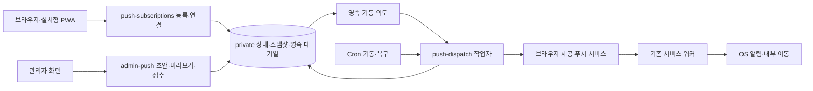

# 웹·PWA 수동 푸시 발송 설계

작성·보완일: 2026-10-07 KST. 상태: **검토 보완·추가 답변 반영 / 구현·실제 UI 승인·운영 적용 전**.

[검토 보고서](push-notifications-review.md)의 P1 5개·P2 4개와 추천 기능을 아래 계약에 통합했다. 전체 발송 전 같은 내용의 기기 테스트 확인은 필수이고, 관리자별 서버 초안 저장을 포함한다. 첫 버전은 기록을 자동 삭제하지 않고 저장량을 관찰한다.

이번 산출물은 설계 문서와 실제 앱에서 분리된 [화면 미리보기](previews/push-notifications.html)다. 아래 라우트·DB 객체·API·설정은 신규 제안이며 구현된 기능이 아니다. 앱 코드, SQL·마이그레이션, DB, Edge Function, 배포 설정은 변경하지 않는다.

## 1. 확정한 제품 범위

| 항목 | 확정 내용 |
|---|---|
| 첫 범위 | 관리자 수동 작성·발송, 선택 회원, 본인 현재 기기 테스트, 발송 이력 |
| 구독 대상 | 비로그인 방문자도 최초 동의로 구독 |
| 발송 대상 | 전체 구독자(비로그인 포함) / 전체 회원 / 선택 회원을 별도로 제공 |
| 이동 위치 | 발송마다 앱 내부 공개 주소 지정. 경로 선택 도우미와 해당 페이지 열기 제공 |
| 수신 설정 | 별도 설정 화면·종류 토글 없음. 동의한 활성 구독에 발송 |
| 대량 발송 전 테스트 | 전체 구독자·전체 회원은 같은 제목·본문·주소의 현재 관리자 기기 테스트 확인 필수 |
| 선택 회원 발송 | 같은 테스트 기능 제공·권장. 필수 조건은 아님 |
| 운영 편의 | 최근 동일 발송 경고, 내용별 테스트 표시, 진행 현황·미전송 중단 |
| 초안 | 서버에 관리자별 저장·불러오기. 수동 저장, 발송과 분리 |
| 기록 보존 | 첫 버전 자동 삭제 없음. 저장량·성장률·용량 제한 관찰 |
| 보류 | 예약, 댓글 등 기능 연동, 공지 가져오기, 읽음·클릭률 수집 |

최초 동의는 브라우저 알림 권한과 해당 사이트의 푸시 등록 확인을 뜻한다. 가입·로그인·PWA 설치만으로 동의했다고 처리하지 않는다. 권한 철회는 브라우저/OS의 사이트 설정을 사용하며 확인된 철회 구독에는 보내지 않는다. 서버가 아직 관측하지 못한 기기 상태는 마지막 확인 상태로 표시한다.

메시지는 일반 운영 안내로 한정한다. 개인 성적·계정 비밀을 잠금 화면에 노출하지 않는다. 광고 캠페인·별도 광고 동의는 이번 설계에 추가하지 않는다. 설정 화면을 만들지 않아도 `권한 허용 → 등록 확인 중 → 완료/실패·재확인` 상태는 안내해야 한다.

## 2. 현재 구조와 확인 제한

- `src/main.tsx`는 `/sw.js`를 등록하고 복귀 시 갱신, controllerchange 후 한 번 재로드한다.
- `src/public/sw.js`는 install·activate만 있고 push·notificationclick이 없다. fetch 가로채기나 오프라인 캐시는 필요하지 않다.
- manifest는 standalone, 현재 아이콘은 SVG다. 실제 설치·알림 검증을 위해 기존 그림의 PNG 192/512 및 알림용 PNG를 제공하는 작업을 구현 때 검토한다.
- `/admin`은 공지·통계·사용자 데이터·디데이 메뉴와 PrivateRoute·AdminRoute·AuthContext를 사용한다.
- 기존 공지는 홈 배너이며 공지 상세 route가 없다. 새 공지 상세 페이지를 가정하거나 만들지 않는다.
- AuthContext logout은 Supabase signOut만 실행한다. 구독의 계정 연결 해제·경쟁 처리는 신규 계약이다.
- 기존 관리자 서버는 JWT 검증과 `current_user_is_admin()`·service-role 전용 RPC를 사용한다. 통계 전용 회원 선택기에서 개인정보 조회 정책을 우회하지 않고 범용 UI만 추출하거나 푸시 adapter를 만든다.
- 운영 문서의 프로젝트와 `supabase/config.toml` ref는 일치하며 웹 origin은 `https://all-leet.vercel.app`이다.

Management API 읽기 전용 메타데이터 조회는 환경 DNS 실패로 미완료다. **원격에 푸시 객체가 없다고 단정하지 않는다.** 구현 전에 public/private 객체, RLS·grants, 관리자 함수, Auth sessions 컬럼·유효성, migration 이력, pg_cron/pg_net 버전을 재확인한다. 설계 조사에 회원 행·성적·endpoint 원문을 조회하지 않는다.

## 3. 책임·영속 실행 구조

Vercel은 정적 SPA 배포를 유지한다. 신규 Edge Function은 아래 세 개로 제안한다.

| 함수 | 책임·호출자 |
|---|---|
| `push-subscriptions` | 익명/회원 기기의 등록·수신 증명·상태·갱신·계정 연결 |
| `admin-push` | 현재 관리자만 초안·회원 검색·대상 확인·테스트·접수·이력·중단·재시도 |
| `push-dispatch` | 서버 내부 인증만. 저장된 등록 확인/캠페인 작업의 점유·전송·결과 |

private 관계형 outbox를 사용한다. 캠페인·기기별 delivery·감사·기동 의도를 같은 DB 트랜잭션에 저장한다. 등록 확인 알림도 영속 작업으로 저장하여 register 성공 직후 함수가 종료되어도 복구한다. 외부 HTTP는 DB 트랜잭션 밖에서 수행한다. 점유에는 SKIP LOCKED를 사용하며 pgmq 신규 활성화는 전제하지 않는다. [PostgreSQL](https://www.postgresql.org/docs/current/sql-select.html), [Supabase Queues](https://supabase.com/docs/guides/queues)

접수 직후 내부 기동은 지연을 줄이는 수단이다. 실패하면 영속 기동 의도가 남고 Cron이 회수한다. 작업자는 시간 예산 안에서 여러 작은 batch를 처리한다. **한 번에 20개 처리하고 다음 1분을 기다리는 구조로 구현하지 않는다.**

기본 제안은 DB의 10초 기동 확인과 1분 복구다. 빈 tick은 due 작업·빈 worker slot만 조회하고 Edge를 호출하지 않는다. 남은 작업과 next_due_at은 영속 보관하고 worker 종료 전에 갱신한다. 원격 pg_cron의 초 단위 지원·pg_net/Vault를 확인해야 하며, 미지원이면 1분 기동 방식의 실측 지원 규모를 낮추거나 지원되는 영속 runner를 선택한 뒤 운영 적용한다. 무제한 재귀 호출로 보충하지 않는다. 이는 대기열 실행 주기이며 관리자 예약 발송이 아니다. [함수 스케줄](https://supabase.com/docs/guides/functions/schedule-functions), [pg_cron 지원 주기](https://github.com/citusdata/pg_cron)

## 4. 기기·회원 연결과 계정 전환

구독은 특정 origin·SW scope·브라우저 실행 환경에 속한다. 동일 사람의 브라우저/PWA·여러 기기를 지문으로 합치지 않는다. endpoint 기준 중복만 제거한다. 회원 건수는 distinct userId, 익명 건수는 구독 수이며 실제 인원으로 표시하지 않는다.

설치의 비밀 capability와 회원 연결은 별개다. `linked_user_id`, 검증 JWT의 `linked_session_id`, `binding_revision`, `subscription_revision`으로 연결한다. member 대상은 실제 활성 계정·유효 세션이 있어야 한다. JWT가 만료 전이라는 사실만으로 로그아웃한 세션을 유효하다고 보지 않는다. 세션 row 존재만으로 충분한지도 시간 제한·비활성 제한 설정과 함께 확인한다. [Supabase 세션](https://supabase.com/docs/guides/auth/sessions)

| 상황 | 계약 |
|---|---|
| 아직 동의하지 않음 / 거절 | 구독 없음. 사용자 클릭 없이 권한창을 재요청하지 않음 |
| 익명 → 로그인 | active 구독 소유 증명 + 유효 JWT·세션으로 연결. 권한 재요청 없음 |
| 로그아웃 | 회원 연결 해제, 동의한 익명 구독 유지. 전체 구독자에는 포함 가능 |
| A → B 계정 | 연결 세대 증가. A 대상 미전송 delivery는 B에 보내지 않음 |
| 같은 회원·같은 세션 token refresh | 연결 의미 불변이면 bind 멱등. 세대를 불필요하게 증가시키지 않음 |
| 철회·unsubscribe 관측 | disabled, 아직 시작하지 않은 작업 skipped |
| endpoint 갱신 | 새 수신 증명 뒤 세대 교체. 옛 세대 delivery는 건너뜀 |
| 탈퇴·정지된 원래 대상 계정 | 전체 발송에서도 제외. 자동 익명 재분류로 다시 보내지 않음 |
| 저장소 유실 | 새 설치의 수신 증명으로 복구. raw endpoint로 기존 소유자 덮어쓰기 금지 |

bind/detach/sync는 `request_id`, `expected_installation_revision`, `expected_binding_revision`, 예상 구독 세대를 보낸다. 서버는 잠금·CAS로 비교한다. 오래된 A의 detach가 최신 B 연결을 지우지 못한다. stale 409에는 상태를 읽고 현재 Auth 의도로 다시 판단하며 오래된 요청을 새 revision으로 자동 재전송하지 않는다.

페이지·SW·다른 탭은 IndexedDB의 단조 증가 의도 세대와 작업 직렬화로 최신 의도를 선택한다. BroadcastChannel은 보조 신호이고 DB CAS가 최종 경계다. 응답이 늦게 도착해도 최신 계정 UI/상태를 덮지 않는다. 로그아웃은 detach를 먼저 시도하지만 실패로 signOut을 막지 않는다. 미처리 의도는 capability만 포함하는 로컬 기록으로 다음 온라인 실행에 대조하며 JWT는 저장하지 않는다. 회원 전송 전 서버의 세션 검사가 추가 방어다.

전체 구독자 캠페인은 일반 안내이므로 정상 로그인/로그아웃만으로 제외하지 않는다. 구독 세대·동의 상태와 스냅샷의 원래 계정 탈퇴/정지 여부는 검사한다. 이미 외부 서비스에 접수한 알림은 계정 전환·중단으로 회수할 수 없다.

## 5. 익명 등록·수신 증명·복구

1. 지원 확인 후 사용자 클릭에서 권한을 요청한다. granted일 때 VAPID 공개키·userVisibleOnly로 subscribe한다.
2. origin·scope별 설치 UUID와 암호학적 난수 32바이트 capability를 IndexedDB에 저장한다. 서버에는 hash만 보관한다.
3. register는 설치 증명, request UUID, 실제 구독 자료를 받아 **pending 등록 요청**과 고정 확인 알림 작업을 원자 저장한다. 이미 검증한 활성 구독의 소유권은 바꾸지 않는다.
4. worker가 고정 문구 `알림 등록 확인`을 표시하는 challenge 푸시를 보낸다. 최초 안내에 확인 알림이 표시됨을 설명한다. silent push를 사용하지 않는다.
5. SW는 저장된 설치 ID·등록 요청 ID·구독 세대·현재 getSubscription의 endpoint/키 fingerprint가 payload의 요청과 일치할 때만 capability와 nonce로 ACK한다. 일치하지 않는 타 설치 요청은 자동 ACK하지 않는다.
6. verify는 요청의 capability와 단회 challenge를 확인한 뒤 활성 소유권을 같은 트랜잭션에서 확정한다. 회원 연결은 별도로 검증 JWT·세션까지 있어야 가능하다.

미확인 요청에는 endpoint 전역 UNIQUE를 적용하지 않는다. `(installation_id, request_id)`만 유일하게 하여 타인의 pending 요청이 정당한 등록을 선점하지 못한다. **검증된 active 구독에만 endpoint_hash 부분 유일성**을 적용한다. 구독 자료 fingerprint는 endpoint와 두 구독 키를 포함하고 승인된 요청 세대와 결합한다. 수신 증명을 통과한 새 설치는 필요하면 기존 active 소유권을 원자 교체하고 옛 세대는 비활성화한다. 같은 설치의 구독 교체도 이전 active 세대를 함께 비활성화하여 한 설치·scope의 현재 구독은 하나로 유지한다. 기존 설치에 늦게 온 challenge가 소유권을 되돌리지 못하도록 최신 등록 의도·활성 소유권 세대도 검사한다.

unsubscribe 후 재구독이 같은 endpoint를 반환할 수 있으므로 endpoint가 바뀌어야만 복구되는 설계를 하지 않는다. 설치 비밀을 잃었으면 새로운 등록 요청의 실제 수신 증명으로 회복한다. pending이 실패해도 같은 설치의 기존 검증 active 구독을 덮거나 끄지 않는다.

등록 요청과 challenge 유효기간은 10분 제안, 확인 알림은 최대 3회 제안이다. ACK 실패는 SW 로컬의 요청 ID·nonce·확인 의도로 남겨 온라인 복귀에 재시도한다. verify 성공 응답이 유실돼도 같은 요청·같은 challenge 재전송은 같은 성공 결과를 반환한다. 임의 challenge 재사용이나 새 계정 연결은 허용하지 않는다. 늦거나 만료된 요청은 active로 올리지 않는다. 만료는 사용 불가 상태이며 기록 삭제와 다르다.

permission granted를 등록 완료로 표시하지 않는다. 등록 확인 중·실패/다시 확인·서버 active 확인 완료를 구분한다. 앱 초기화·로그인 변경·온라인/포커스 복귀 때 permission/getSubscription·서버 state를 동기화한다. 변경 이벤트는 보조이며 expirationTime=null을 영구 구독으로 취급하지 않는다. 자동 동기화는 권한창을 띄우지 않고 disabled를 권한값만으로 되살리지 않는다. [변경 이벤트 지원](https://developer.mozilla.org/en-US/docs/Web/API/ServiceWorkerGlobalScope/pushsubscriptionchange_event), [구독 만료 값](https://developer.mozilla.org/en-US/docs/Web/API/PushSubscription/expirationTime)

요청 본문·base64url 키 길이·provider endpoint를 검사한다. HTTPS 443·실제 확인한 공식 provider host만 허용하고 IP/localhost/userinfo/임의 포트/redirect를 거부한다. worker도 전송 직전 재검증한다. 설치·endpoint·IP별 등록/확인 한도를 적용하며 raw IP를 장기 보관하지 않는다. capability·nonce·JWT·endpoint/키를 URL·분석·오류 로그에 넣지 않는다. IndexedDB 실패에는 완료를 표시하지 않는다.

## 6. 관리자 입력·초안·테스트

제안 route `/admin/push`, 메뉴 `푸시 알림`, 새 발송·초안·발송 이력 화면은 실제 UI 승인 후 구현한다. 기존 PrivateRoute·AdminRoute를 사용하고 관리자 계정 변경 때 재마운트한다. 401/403에는 목록·선택·입력·응답을 지우고 이전 계정의 늦은 응답을 무시한다.

| 입력 | 계약 |
|---|---|
| 제목 | trim 후 Unicode 코드 포인트 1~50자 |
| 본문 | 일반 텍스트 1~200자. HTML·Markdown 실행 없음 |
| 이동 주소 | 정규화한 앱 내부 공개 route, 1,000자 이하 |
| 대상 | 전체 구독자 / 전체 회원 / 선택 회원. 테스트는 별도 동작 |
| 선택 회원 | 현재 활성 계정 UUID, 중복 제거, 최대 100명 제안 |
| payload | 메타데이터 포함 UTF-8 JSON 3KiB 이하의 보수적 제한 |

경로 도우미는 `/`, `/past-exams`, `/community` 등 실제 공개 route를 제공하고 자유 내부 경로 입력을 유지한다. 해당 페이지 열기는 새 탭의 동일 origin URL·noopener로 제공한다. 서버와 SW에서 허용 route·query를 함께 검사한다. 외부 URL·`//`·역슬래시·제어 문자·이중 인코딩 우회·`/admin/*`·비밀번호 token·이메일·개인 결과 query·없는 공지 상세 route는 거부한다. 삭제된 공개 게시글은 기존 오류/홈 복귀 흐름을 사용한다.

### 관리자별 서버 초안

초안은 actor 소유로 저장하고 다른 관리자에게 노출하지 않는다. 제목·본문·경로·대상·선택 회원 UUID·draft_revision만 저장하며 endpoint·키·실시간 건수·preview token·test 확인을 저장하지 않는다. 초안은 미완성 입력을 허용하되 최대 길이·크기는 검사한다. 불러올 때 권한·현재 회원·경로를 다시 검증한다. 탈퇴/정지 회원은 선택에서 제외하고 안내한다.

첫 버전은 명시적인 `초안 저장`·목록·불러오기를 제공한다. 수정 저장은 expected_revision과 request UUID로 CAS·멱등 처리하고 충돌하면 서버 내용을 덮지 않는다. 불러오기는 현재 미저장 입력이 있으면 확인한다. 자동 저장·초안 삭제는 이번 범위에 추가하지 않는다. 발송 후 초안은 남으며 발송 여부·시각을 표시한다. 불러오기·발송 대상/내용 변경은 preview를 무효화하며 테스트 확인은 새 작성 버전에 다시 연결해야 한다. 로컬스토리지에 관리자 내용이나 JWT를 보관하지 않는다.

### 현재 기기 테스트와 전체 발송 필수 확인

테스트는 현재 관리자·현재 브라우저의 소유 확인된 구독 **1개**에 같은 sender/worker/provider로 보낸다. 다른 본인 기기로 확대하지 않는다. 별도 test 캠페인으로 남기며 등록 확인 알림은 내용 테스트로 인정하지 않는다.

테스트 내용 hash는 서버가 정규화한 제목·본문·이동 주소·payload 버전을 묶어 만든다. 전체 발송 대상은 테스트 대상과 다르므로 이 hash에 audience를 섞지 않는다. 발송 preview는 audience·선택 회원까지 포함하는 별도 request hash를 사용한다. 제목·본문·주소 변경은 테스트 확인을 무효화한다. 대상만 변경했을 때는 preview만 무효화하되 같은 내용 테스트는 재사용할 수 있다.

provider accepted를 확인한 test에 대해 관리자가 실제 기기 표시와 클릭 이동을 확인하고 `기기에서 확인했습니다`를 제출한다. 서버는 actor·현재 설치/구독 세대·내용 hash·test campaign ID를 검증해 확인 기록을 남긴다. 이는 관리자 확인 진술이며 서버가 OS 표시를 측정한 수신 증명이 아니다. accepted만 있거나 체크박스만 보낸 경우 확인 완료가 아니다. unknown/failed test는 새 테스트가 필요하다.

확인 유효기간은 테스트 접수 후 24시간 제안이며 최초 운영 전에 설정값을 확정한다. 전체 구독자·전체 회원은 같은 actor·내용·현재 설치 세대의 유효 확인 없이는 preview 승인·캠페인 접수를 모두 거부한다. 접수 트랜잭션에서 다시 검사하므로 다른 클라이언트로 우회할 수 없다. 선택 회원은 권장 안내만 제공한다. 초안 저장/복원으로 확인을 영구 재사용하지 않는다. 복원은 확인 기록을 삭제하는 대신 새 작성 버전에서 기존 확인을 자동 선택하지 않고 현재 기기 테스트를 다시 요구한다. 실제 운영 기기 테스트는 구현 검증 때 승인된 기기·범위에서만 수행한다.

## 7. 대상 미리보기·최근 중복·원자 접수

전체 구독자는 회원 연결과 익명 active 구독을 합쳐 endpoint 기준으로 중복 제거한다. 전체 회원·선택 회원은 유효 회원·세션 연결의 active 구독만이다. 가입 회원 수와 구독 회원 수를 혼동하지 않는다. 구독 없는 선택 회원은 0개이고 표시하며, 대상 구독이 전부 0개면 접수하지 않는다. 관리자는 동의했다면 일반 대상에도 포함한다. 기존 이용 통계의 관리자 제외 규칙을 적용하지 않는다.

### 안전한 감소를 허용하는 짧은 스냅샷

preview API는 내용 검증·테스트 확인 후 **private 서버 preview와 후보 구독 snapshot을 저장**한다. 이는 조회만 하는 API가 아니며 초안·실제 발송과 구분한다. 후보에는 구독 ID·세대·회원 연결 세대·원래 대상 UUID, 내용/대상 hash·actor·유효기간을 고정한다. preview ID와 난수 token을 반환하고 서버에는 token hash를 보관한다. 유효기간 5분 제안. endpoint/비밀은 반환하지 않는다.

최종 접수는 이 후보 집합만 재검사한다. 동의 철회·세션 종료·세대 변경·계정 탈퇴 같은 안전한 감소는 제외 사유와 감소 건수로 반환하며 확인 반복을 강제하지 않는다. 이후 새 구독·새 회원·같은 건수의 대상 교체는 추가하지 않는다. 회원 대상에서 연결/구독 세대가 달라지면 현재 동일 회원이라도 옛 후보에서 제외한다. 만료 preview, 내용·대상 hash/actor 변경은 409/410로 다시 확인한다. 하나의 preview는 하나의 캠페인만 접수한다.

최종 확인은 제목·본문·주소·대상·후보 건수·테스트 확인 시각·중복 경고를 표시한다. 접수 응답은 후보 수·접수 전 제외 수·실제 delivery 수를 구분한다. 이후 처리 결과의 합계는 **실제 접수 delivery 수**와 맞추고 preview 당시 숫자를 분모로 쓰지 않는다. 접수 시 전부 제외면 캠페인을 만들지 않고 사유를 반환한다.

캠페인 최대 10,000개 후보는 기술 검증용 상한 제안이며 현재 지원 규모를 의미하지 않는다. 초과하면 오류로 알리고 일부만 조용히 보내지 않는다. 원자 INSERT SELECT의 잠금·시간·용량을 합성 데이터로 검증한 뒤 운영 상한을 정한다.

### 최근 동일 발송 경고

최근 10분 제안 구간의 manual 캠페인에서 정규화 내용 hash가 같고 frozen 대상이 겹치면 최근 시각·발송자·상태·겹치는 구독 수를 표시한다. test·등록 확인은 제외한다. endpoint/익명 신원을 표시하지 않는다. 같은 내용의 정당한 반복은 금지하지 않으며 `중복 가능성을 확인하고 진행`이 필요하다.

서버는 경고 대상 campaign ID 집합의 digest를 만들고 최종 접수에서 재검사한다. preview 뒤 새로운 겹치는 발송이 생기면 갱신된 경고 확인만 요구하고 원래 후보 집합은 유지한다. 접수·중복 검사에는 짧은 직렬화 경계를 두어 동시 캠페인 둘이 서로를 놓치지 않게 한다. 외부 전송은 이 경계에서 하지 않는다. 이 경고는 idempotency와 다른 운영 실수 방지다.

### 재요청·대조

캠페인·delivery·감사·기동 의도는 같은 트랜잭션에서 접수한다. `(actor_id, idempotency_key)`는 유일하며 같은 key·같은 요청은 같은 campaign ID를 반환한다. 같은 key·다른 내용은 409다. 이미 접수한 요청은 preview가 나중에 만료되어도 원 요청 hash 대조 후 기존 결과를 반환한다. timeout에는 새 key로 자동 재접수하지 않고 본인 key로 상태를 대조한다.

## 8. 신규 private 데이터·접근 경계

아래는 설계 객체이며 SQL·migration은 작성/적용하지 않는다. UUID, timestamptz, bigint revision, text + check 상태·길이 제한을 기본으로 한다. Postgres 제약·인덱스는 실제 원격과 합성 부하 확인 후 migration으로 확정한다.

| 객체 제안 | 역할·핵심 계약 |
|---|---|
| `push_installations` | capability hash, 설치 revision, 최신 등록 의도·마지막 확인 시각 |
| `push_registration_requests` | 설치/request UUID 유일, 암호화 후보 endpoint/키·key ID·fingerprint, pending/verified/expired/failed, 만료·확인 delivery 참조 |
| `push_registration_challenges` | 요청 ID·nonce hash·예상 세대·만료·consumed 결과. 동일 ACK 성공 대조 |
| `push_subscriptions` | 검증된 구독만. active/disabled, 설치·구독/연결 세대, encrypted endpoint/keys·암호화/VAPID key ID, linked user/session. active endpoint hash 부분 유일 |
| `push_drafts` | actor 소유 내용·대상·선택 UUID·revision·최종 저장/발송 정보. 수동 저장 멱등성 |
| `push_previews` / `push_preview_recipients` | actor·token hash·내용/대상 hash·만료·used campaign ID, 후보 구독/연결 세대. 초안·발송과 별도 |
| `push_test_confirmations` | actor·test campaign·내용 hash·설치/구독 세대·확인/만료 시각. 기기 확인 진술 |
| `push_campaigns` / `push_campaign_members` | manual/test, actor·idempotency·내용·TTL·대상, 후보/제외/접수 수, 상태·중단 이유·revision, 선택 회원 snapshot |
| `push_deliveries` | campaign 또는 등록 확인 요청 중 하나만 참조, 논리 대상·세대, 상태·current attempt·lease·next_due. 캠페인 구독/세대 조합 유일 |
| `push_delivery_attempts` / `push_attempt_events` | delivery/attempt_no 유일한 불변 시도 식별·lease/수행자, append-only 시작/결과/늦은 관측 이벤트. 시도별 이력 |
| `push_request_receipts` | 설치 또는 actor·operation·request UUID 유일. 요청 hash·처리 결과/revision 대조, bind/detach/sync·초안 저장·테스트 확인 멱등성. 비밀 원문 없음 |
| `push_admin_audit` | 초안 변경·확인·접수·중단·재시도와 개인정보 조회 감사. 내용/비밀 원문 없음 |
| `push_dispatch_control` / `push_worker_slots` | 영속 기동 의도·next_due, 스위치·quota·provider/key cooldown, 동시 slot lease |

등록 확인 delivery는 admin campaign을 생성하지 않으며 고정 payload/한도만 사용한다. 관리자 화면에 타인의 설치 자료나 challenge를 노출하지 않는다. 논리 delivery와 외부 시도 attempt를 구분한다. attempt 식별 행은 불변이고 시작·결과 이벤트는 별도 append-only 기록으로 보존한다. 같은 이벤트의 재저장은 이벤트 ID로 대조하며 원래 결과를 덮지 않는다. delivery에는 현재 집계 상태만 유지한다. 늦은 결과도 원 attempt의 추가 관측으로만 남긴다. 감사는 append-only이며 service role에도 UPDATE/DELETE를 주지 않는다.

private 전체 RLS, PUBLIC/anon/authenticated 직접 권한 없음, Data API schema 비노출. service role에도 필요한 권한만 준다. public RPC wrapper는 service-only EXECUTE·SECURITY INVOKER, 기본 PUBLIC 실행 권한을 명시 회수한다. 관리자 RPC는 실제 actor의 현재 역할을 재검사하고 초안은 actor 소유를 확인한다. 조회 감사가 기존 정책상 필요하면 감사 실패 시 개인정보 결과를 반환하지 않는다. 상태 변경 감사는 같은 트랜잭션에 저장한다. [RLS](https://supabase.com/docs/guides/database/postgres/row-level-security)

기존 성적·커뮤니티·이용 기록의 탈퇴 보관/삭제 흐름에 cascade를 추가하지 않는다. 원격 Auth FK·soft/hard 탈퇴를 확인하되 과거 actor/target UUID는 감사 식별이고 현재 유효 회원이라는 뜻이 아니다.

**첫 버전은 모든 푸시 기록의 자동 물리 삭제를 하지 않는다.** 초안·만료 등록/preview·비활성 구독·attempt·감사도 보관한다. TTL은 발송/사용 가능 기간만 제한한다. 이력 기본 조회는 최근 90일이고 더 오래된 기록도 기간 필터·커서로 조회한다. 상태별 행/암호문 바이트·성장률·quota 경보를 관찰하고 용량 한도 도달 시 새 등록/접수에 명시적 제한을 건다. 자동 청소나 기존 서비스 데이터 삭제로 해소하지 않는다. 보존 정책 변경은 별도 결정이다.

## 9. API·인증 계약

신규 경로는 `/functions/v1/<함수>/<경로>` 제안이다. 응답 no-store, 제한된 origin CORS. CORS를 인증으로 취급하지 않는다. capability는 body, 로그인 JWT는 Authorization에만 전송한다.

| API | 인증·동작 |
|---|---|
| subscriptions `POST /register`, `/verify`, `/state`, `/sync` | 의도적 익명 transport + capability, 제한된 등록/자기 상태만. JWT가 있으면 반드시 검증 |
| subscriptions `POST /bind` | capability + 검증 JWT·유효 session + expected revisions |
| subscriptions `POST /detach` | capability + expected revisions. 익명 상태에서도 최신 설치 의도로 연결 해제 가능 |
| admin `POST /draft-save`, `/draft-list`, `/draft-load` | 현재 관리자·actor 소유, revision/request UUID 검사 |
| admin `POST /members` | 현재 관리자, 검색·최소 이름/이메일·구독 수·커서, 기존 조회 감사 |
| admin `POST /test`, `/test-confirm` | 현재 관리자·현재 설치 증명, 테스트 접수 / accepted 대조·확인 기록 |
| admin `POST /preview` | 내용·필수 테스트·후보 snapshot 저장. 실제 발송 아님 |
| admin `POST /campaigns` | preview·유효 테스트·중복 경고 확인·idempotency, 원자 202 접수 |
| admin `POST /campaign-status`, `/campaign-history` | 현재 관리자, campaign ID/본인 key 대조·진행·커서 이력 |
| admin `POST /stop`, `/retry-unknown` | 현재 관리자·예상 revision, 중단 / 중복 경고·TTL·시도 상한 확인 |
| dispatch `POST /run` | 내부 서버 인증만. 저장된 due 작업만 처리, 임의 payload/endpoint 수신 금지 |

익명 요청은 별도 fetch wrapper로 `apikey: publishable/anon`을 보내고 **Authorization을 생략**한다. Supabase SDK가 공개 anon 키를 Bearer에 자동 넣는 transport에 기대지 않는다. apikey는 사용자 신원을 증명하지 않는다. `/bind`·admin은 실제 access token만 Bearer로 쓰고 `/run`은 Vault/Edge secret의 별도 내부 인증을 사용한다. 잘못된 JWT가 있으면 401이며 익명으로 강등하지 않는다.

게이트웨이 verify_jwt와 함수 내부 auth 설정은 현재 공식 규약·키 형식으로 구현 테스트한다. 익명 경로를 허용하기 위해 플랫폼 JWT 검사를 해제하는 경우에도 함수의 명시적 경로별 검증을 유지한다. 기존 함수 설정을 일괄 변경하지 않는다. 최신 라이브러리 도입·마이그레이션을 이번 설계의 전제로 삼지 않는다. [Edge 인증](https://supabase.com/docs/guides/functions/auth)

오류: 400 입력, 401 인증, 403 권한, 409 revision/내용/확인 충돌, 410 만료, 429 한도, 503 Auth/DB/키 불가. 내부 장애는 실패로 단정해 사용자를 제외하지 않고 보류·진단한다. console에는 안전한 코드와 요청 ID만 남기고 사용자에게 한국어 안내를 제공한다.

## 10. Worker·시도 이력·재시도·중단

초기 부하 설정 제안은 worker slot 2개, worker별 HTTP 동시 5개, batch 최대 10개, 작업 예산 25초, HTTP timeout 5초, lease 60초다. **실측 전 운영 보장값이 아니다.** batch를 반복하되 각 호출 시작 전 timeout+DB 결과 기록 여유(초기 2초 제안)가 남아야 한다. 남지 않으면 외부 미시작 점유를 반납하고 영속 기동 의도를 남긴다. CPU·암호화·DB 왕복을 포함해 조정하며 Supabase CPU 제한을 별도 검증한다. [함수 제한](https://supabase.com/docs/guides/functions/limits)

1. due delivery를 공정하게 점유한다. 캠페인·provider별 작은 batch로 한 캠페인/장애 provider가 전체 slot을 독점하지 않게 한다. 새 lease token과 attempt ID를 생성한다.
2. 외부 시작 RPC는 delivery 잠금 아래 `leased`, current attempt, token, delivery와 worker slot의 lease/token 유효성, TTL, 동의·구독 세대, 중단/운영 스위치, provider/key cooldown·quota를 검사한다. member/test는 연결 세대·계정·세션, 전체 구독자는 원래 대상 계정의 탈퇴/정지를 검사한다.
3. 캠페인 작성자의 현재 관리자 역할·활성 계정도 검사한다. 실제 역할 회수/탈퇴/정지는 캠페인 미시작 작업을 중단한다. Auth/DB 불가에는 fail-closed로 보류한다. 작성자의 정상 로그아웃·화면 닫기는 캠페인을 중단하지 않는다.
4. 승인된 시작·quota 소비·attempt 외부 시작 이벤트를 영속 저장한 뒤 HTTP를 실행한다. 기록 실패에는 전송하지 않는다. 원격 provider 요청은 트랜잭션 밖이다.
5. 결과 확정은 현재 attempt/token·lease·상태 CAS로 집계한다. 중단 중인 이미 시작한 결과도 기록한다. 점유를 잃은 늦은 응답은 원 attempt 관측에만 추가하며 현재 delivery/새 attempt를 덮지 않는다.
6. lease 만료 때 외부 시작 기록이 없으면 안전하게 회수한다. 시작 기록이 있으면 unknown으로 분류하고 자동 재전송하지 않는다. slot 회수와 다음 기동 의도도 영속 처리한다.

| 관측 결과 | 처리 |
|---|---|
| provider 계약의 성공 상태 | accepted. 푸시 서비스 접수이며 실제 기기 표시/읽음 아님 |
| 404/410 | failed + 동일 구독 세대만 disabled |
| 명확한 거절 429 | retry_wait, Retry-After·provider cooldown 존중 |
| 외부 요청 전 실패가 확실 | retry_wait |
| 5xx, timeout, 전송 후 연결 종료, 결과 저장 유실 | 기본 unknown. 미접수 보장 근거 없는 자동 재전송 금지 |
| 400/401/403, 3xx | 오류/진단, redirect 금지. 설정 장애는 provider/key 차단, 권한 철회로 추정 금지 |
| 동의 철회·세대 변경·계정 종료·TTL·미시작 중단 | skipped + 이유 |

등록 확인의 재전송은 별도 고정 메시지 한도·만료를 사용한다. 캠페인 재시도는 자동/수동 합산 **총 3회 시도 제안**, 지수 지연+jitter·기존 TTL 이내다. HTTP를 시작한 attempt는 이 한도에 포함한다. 시작 전 중단/예산 반납은 외부 시도 횟수를 소비하지 않는다. 새 attempt는 새 시작 기록을 갖고 이전 attempt를 재사용하지 않는다. Retry-After가 TTL을 넘으면 새 외부 호출을 만들지 않고 만료 제외로 마무리한다.

unknown 재전송은 관리자에게 중복 가능성을 표시하고 명시 확인·예상 revision·감사·현재 lease 없음·quota·시도 한도·기존 TTL을 모두 요구한다. completed 캠페인은 해당 delivery를 다시 pending으로 바꾸고 processing·revision 증가로 전환한다. stopping/stopped 캠페인은 재개하지 않는다. unknown의 늦은 accepted 관측은 자동 재시도나 새 시도 덮어쓰기로 이어지지 않는다.

TTL 초기 제안은 24시간, provider TTL은 남은 시간이다. payload delivery ID·notification tag로 중복 표시를 완화하지만 외부 서비스와 DB의 분산 트랜잭션이 없으므로 exactly-once를 보장하지 않는다. [Web Push RFC의 접수 의미](https://datatracker.ietf.org/doc/html/rfc8030#section-5), [알림 tag](https://developer.mozilla.org/en-US/docs/Web/API/Notification/tag)

상태는 queued/processing/completed/stopping/stopped. delivery는 pending/leased/retry_wait/accepted/failed/unknown/skipped이며 합계는 실제 접수 수다. completed는 모든 논리 대상이 분류됐다는 뜻이다. 이력에는 접수·실패·미확인·제외·처리 중, 마지막 갱신 시각을 제공한다. 화면이 보일 때만 2~5초 폴링, 숨김/로그아웃/403에는 멈춘다. 다시 열어도 서버 상태로 복원한다.

중단은 외부 시작 검사와 같은 잠금 경계에서 플래그를 기록한다. 아직 시작하지 않은 작업은 skipped, 이미 시작한 작업은 결과 확정/lease 회수까지 stopping으로 유지한 뒤 stopped가 된다. 버튼 클릭 즉시 모든 전송이 끝났다고 표시하지 않는다. 이미 접수한 알림은 회수할 수 없다.

## 11. 서비스 워커·지원·운영 안전장치

기존 sw.js에 push·notificationclick과 확인 ACK만 확장한다. scope·캐시 정책·등록 업데이트 흐름을 유지하고 waitUntil로 이벤트 처리를 기다린다. 일반 payload는 `{version, deliveryId, title, body, path, expiresAt}`, 등록 확인은 별도 type·요청/설치 식별·fingerprint·단회 challenge다. 개인 정보·JWT·capability는 payload에 넣지 않는다.

알림 icon은 자사 정적 PNG만 사용한다. 외부 이미지·액션·배지 카운트는 보류한다. malformed/만료 payload에는 안전한 일반 사이트 알림·홈 경로를 사용하고 내부 nonce를 본문에 노출하지 않는다. 서버/provider TTL을 우선 적용한다. 클릭은 same-origin client navigate/focus 또는 openWindow이며 외부 URL은 열지 않는다. 클릭 분석 서버 쓰기나 개인 Auth fetch는 하지 않는다.

| 환경 | 지원 계약 |
|---|---|
| 지원 PC 브라우저 | 웹 상태에서 가능. 설치를 필수로 안내하지 않음 |
| 지원 Android 브라우저/PWA | 실제 실행 환경의 구독 기준 |
| iOS/iPadOS 16.4 이상 | 홈 화면에 추가한 웹앱에서 사용자 클릭으로 요청 |
| 미지원/in-app/blocked | 기능 지원·실제 subscribe 결과에 따라 안내 |

secure context·SW·PushManager·Notifications API를 확인하며 UA만으로 성공을 단정하지 않는다. 일반 iPhone 탭은 설치 안내, Safari와 홈 화면 앱의 저장소·세션 공유는 전제하지 않는다. [WebKit](https://webkit.org/blog/13878/web-push-for-web-apps-on-ios-and-ipados/), [구독 API](https://developer.mozilla.org/en-US/docs/Web/API/PushManager/subscribe), [클릭 API](https://developer.mozilla.org/en-US/docs/Web/API/ServiceWorkerGlobalScope/notificationclick_event)

서버 설정은 VAPID key ID별 키·subject, 인증 암호화 keyring·key ID, 내부 dispatch secret, 허용 origin/provider, PUSH_ENABLED=false다. 브라우저에는 VAPID 공개키와 공개 설정만 넣는다. 자동 생성 info.tsx를 편집하지 않는다. 키를 배포마다 재생성하지 않고 이전 키 복구·재암호화·재구독 절차를 둔다. 암호문에는 버전·nonce·인증 tag를 포함하고 백업 복원도 keyring과 함께 검증한다. [VAPID 라이브러리 안내](https://github.com/web-push-libs/web-push)

Deno 호환 Web Push 암호화/VAPID 라이브러리를 실제 Edge에서 먼저 검증·버전 고정한다. 직접 암호화 규격을 재구현하지 않는다. local/preview 기본 off, 운영 origin·DB 스위치·서버 스위치를 모두 요구한다. 첫 활성화는 테스트만 허용한 뒤 전체 발송을 연다.

provider/key별 circuit breaker·cooldown과 전역 스위치를 분리한다. 반복 401/403·키 오류는 해당 조합을 차단하고 정상 provider는 처리할 수 있게 한다. 429는 제공한 대기 시간을 따른다. 관리자별 캠페인/테스트 빈도, 전체 일일 외부 요청, worker 동시 slot, 설치/endpoint/IP별 pending·확인 알림, preview/초안 저장 빈도·크기를 제한한다. 등록 확인도 외부 요청 quota에 포함한다. 구체 수치는 합성 부하·실제 지원 기기·허용 비용으로 운영 전에 확정한다.

관찰: active/pending, due backlog·최장 대기·처리 속도, provider별 결과, unknown·lease 회수, 마지막 worker 성공, Auth/DB 오류, 저장량·성장률·quota/cooldown. 정상 provider 조건의 **1,000개 구독 5분 내 처리**는 검증 목표 제안이며 현재 보장 아니다. 10,000개는 별도 측정한다. 429·느린 네트워크·기기 오프라인은 목표와 구분한다. 중단/롤백은 스위치·기동을 끄고 기록을 보존하는 방식이다.

## 12. 구현·검증·운영 적용

예상 프론트: AdminPushPage, 최초 동의 안내, usePushSubscription, subscription/admin API wrapper, 공유 타입/검증, SW·AuthContext 연결 hook·App route·관리자 메뉴. 기존 공지·성적·채팅·통계 저장 흐름은 이번 범위에서 변경하지 않는다.

예상 서버: push-subscriptions/admin-push/push-dispatch, _shared 순수 계약·인가·worker 주입 모듈, 신규 migration. config/CI의 세 함수 등록·배포 대상과 기존 중복 소스 경로를 구분한다.

| 검증 층 | 필수 시나리오 |
|---|---|
| 순수 로직 | 문자/바이트·안전 route·내용 hash·대상 중복·TTL·retry/unknown·합계 |
| 합성 SQL | private/RPC 권한, pending 선점 방지·active 원자 교체, preview 증가/감소/동일 건수 교체, idempotency 응답 유실, CAS·lease·중단 경쟁·append 감사 |
| Edge 주입 | apikey/실제 JWT/무효 JWT/내부 secret, 계정·role 회수·Auth 장애, SSRF/redirect, 등록 ACK 유실/만료/역전, 늦은 결과·provider별 차단 |
| 관리자 모의 화면 | 테스트 미확인 전체 발송 거절·내용 변경 무효·서버 우회 방지, 초안 계정 격리/충돌/복원, 중복 경고·0개·timeout 대조·403 제거·진행/중단 |
| 기기 모의 흐름 | 허용/거절/iPhone 설치·pending/실패/재확인, A detach/B bind·다른 탭·token refresh·저장소 유실·온라인 복귀 |
| 격리 SW | 실제 SW 테스트 환경에서 push/클릭 주입·IDB ACK·update 재로드·잘못된 challenge |
| 부하 | 암호화 CPU/DB/provider 지연, 여러 batch·slot·빈 tick·기동 유실·fairness, 1,000/10,000개·저장량·quota |
| 승인된 실기기 | PC/Android/iPhone 홈 화면, foreground/background/닫힘·권한 철회·만료·링크 이동 |

모의 provider·격리 DB가 기본이다. 운영 연결 로컬에서는 **preview 저장·초안 저장·테스트 확인도 쓰기 요청**이므로 구독/발송과 함께 실행하지 않는다. 일반 GET/조회라도 기존 감사 쓰기가 발생하면 모킹한다. 실제 테스트는 명시 승인한 기기·별도 환경/범위에서만 한다.

구현 순서: 구체적인 분리 UI 승인 → 원격 메타데이터 → Deno/provider·주기/처리량 기술 검증 → 합성 DB/API/worker → 등록/연결 → 관리자/SW → npm run check·화면·실기기 → DB·secrets·함수·Cron·웹 운영 적용. 새 검사 명령은 구현 후 등록하며 현재 없는 명령을 실행 가능하다고 문서화하지 않는다. DB/Edge 배포·main push는 별도 명시 요청 뒤 실행한다.

현재 문서/목업 검증은 링크·오프라인 렌더링·가상 흐름에 한정한다. 실제 푸시·DB 권한·부하 검증 완료를 의미하지 않는다.

## 13. 남은 승인·기술 확인

제품 선택은 이번 답변으로 확정했다. 실제 앱 UI를 변경하기 전 관리자 화면·초안·테스트 확인·중단·동의 위치/문구의 구체적 범위를 미리보기로 승인받는다. 설계 반영은 실제 UI 변경 승인으로 간주하지 않는다.

구현에서 확인할 항목은 원격 객체/권한·Auth 세션 유효성, provider 허용 목록·Deno 라이브러리, 초 단위 Cron·기동 방식, 부하/용량·quota 수치, 테스트 확인 유효기간이다. 제안 수치는 실측 후 문서와 함께 확정한다. 기록 자동 삭제는 보류가 아니라 **첫 버전 미사용으로 확정**했다.

## 14. 출처·검토 이력

2026-10-07에 공식 Push RFC·MDN·WebKit·Supabase Auth/RLS/함수/스케줄 문서와 pg_cron 안내를 확인했다. 플랫폼 제한·버전은 구현 시 다시 확인한다. Supabase changelog 전체 index는 웹 도구 형식 제한·환경 DNS 실패로 미완료이며 현재 의존성 변경은 없다. [공식 변경 내역](https://supabase.com/changelog?types=breaking-change)

원 검토의 문제·근거는 [검토 보고서](push-notifications-review.md), 화면 제안은 [분리 미리보기](previews/push-notifications.html)에 보존한다.
